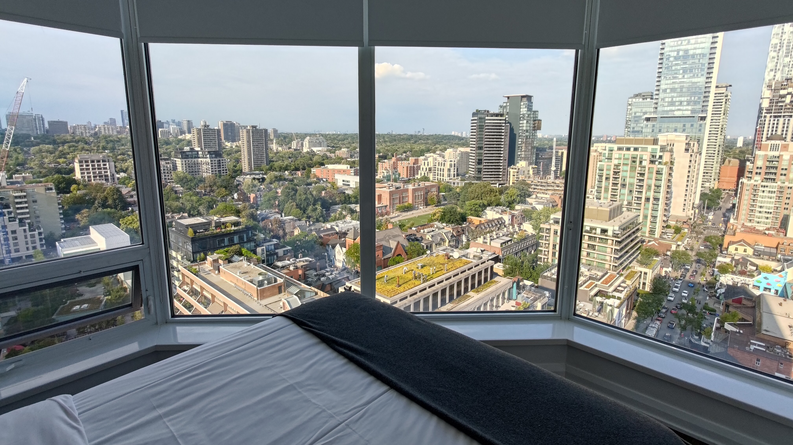
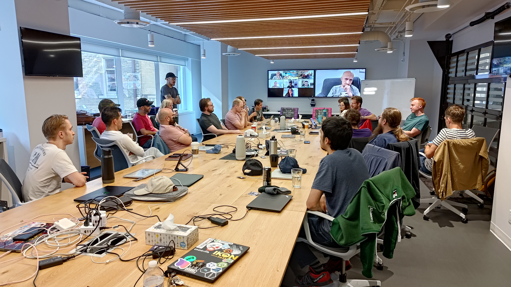

This week, my company (Beeper) had our fall work retreat in Toronto, Canada. It
has been nearly six months since our
[March retreat in Amsterdam]()
and it was great to see everyone again and meet some of the new team members.
I have also written about our
[four]()
[retreats]()
[prior]()
[to]()
[Amsterdam]()
on this blog.

One of the main goals of each retreat is to provide opportunities to connect as
a team on a personal level. There were three new team members present at this
retreat.

Ana is a new member of our customer support team. She has the honour of the
longest travel time to come to the retreat; she flew all the way from Auckland,
New Zealand including a 17 hour direct flight from Auckland Airport to Chicago
O'Hare. But the most amazing part is that she made the trip with her unborn baby
who is due in only a few months!

[Josh](https://imjosh.in/) is a new member of the desktop team and he is also a
professional photographer! He actually drove from Michigan up to Toronto instead
of flying. He joined a couple months ago from Gatsby (acquired by Netlify) and
has already worked on some cool projects like the [ability to invite friends to
Beeper](https://blog.beeper.com/p/invite-friends-to-beeper).

Jonathan is a product designer who joined recently and is spearheading projects
such as building out Beeper's brand identity, figuring out how to position
Beeper in the market, and making the UX of each app delightful.

## Venue

We stayed at [Avalon Suites Yorkville](https://www.avalontoronto.com/) which is
a company that does short-term rentals of condos. The check-in was a bit strange
since it is a residential building so there's not hotel staff to do the
check-in, but my room was spacious and had amazing views.

<figure>
<table class="gallery">
<tr>
<td>

**The view from the bedroom of my suite.**

 
</td>
<td>

**The view out the window of the living room of my suite.**

</td>
</tr>
</table>
</figure>

Our workspace consisted of a large conference room and a couple smaller ones in
the very nice office of [Top Hat](https://tophat.com/) an education software
startup that was a block away from the hotel.

## The iMessage Corner of Happiness!

One of the main goals of the week was to work on some major improvements to our
iMessage experience. I can't tell you much about it, but iMessage is soon going
to be faster and more reliable.

At the previous retreat in Amsterdam, one of our main struggles was improving
the iMessage bridge experience. For much of that retreat, a large portion of our
backend team sat together in one corner of the workspace trying to figure out a
plan of attack. Brad dubbed the corner the "iMessage Corner of Sadness".
However, in the time between retreats, we have made a few breakthroughs and we
are optimistic about the future of iMessage on Beeper. A large number of us
still are working on iMessage, but this time it was in the "iMessage Corner of
Happiness!".

Myself and Tulir worked closely during the retreat to fix bugs and add features
to the bridge. There was one feature that Tulir implemented that I proceeded to
break multiple times due to somewhat complex interactions in the code. Luckily,
Tulir found and fixed that feature every time I broke it, and I was able to
learn how a couple more areas of the code interact with one another.

## `libwebp` and Other Bridge Madness

Last week on 12 September, a CVE for `libwebp` was published which affects many
of our bridges because they use the library for processing bridged images. As
such, Tulir and I spend half a day updating all of the bridges to use patched
versions of the library. Really, it was mainly Tulir who did the work because I
only updated one our our bridges: LinkedIn. I ended up having to fix an issue
introduced by changes to a recent Python version which caused the LinkedIn
bridge to fail to start up before I could actually update the `libwebp`
dependency.

## Adventure Day

On Thursday, we split up into a few groups and explored the Toronto area. A
large contingency went to Niagara Falls. I'd visited the falls on the day before
the retreat, so I instead opted to go over to a disc golf course on one of the
Toronto islands.

Ten of us took a ferry across to Ward's island. The views of Toronto across the
bay were fantastic!



Adam had gotten some used discs from a local disc golf club in the area for us
to use, and we split up into a couple groups and played the course. I was with
Adam, Josh, Tulir, and Eric. Adam and Josh were very good compared to the rest
of us. Adam plays regularly, and Josh has played more than any of the rest of
us. Adam was three under through 18, and Josh was 19 over through 18. I stopped
counting around hole 5 when I was already 20 over 😂. I did manage to get par on
a couple of the holes, though!

Most of the time, Adam's and Josh's first throw would get really close to the
pin, then the rest of us would spend a couple of throws getting to where their
first throws landed.



It was an absolutely beautiful day, and it was a great way to get away from my
screen and get some fresh air and exercise!

## Kings of the Bootleggers

In the evening on Thursday, Annie organized an escape room! The unique part of
this escape room was that there were live actors who we had to interact with to
get various clues. They also helped us out when we got stuck.

The venue was a really cool castle (actually, the room was across the street,
but there was a secret tunnel leading from the castle to the house).



The story of the escape room was that we were recruited to help take over a
bootlegging operation, but unfortunately, we were discovered and we had to
escape through a secret exit. However, to find to the secret exit, we had to
solve a bunch of puzzles! Eleven Beepsters participated in the escape room and
we had four other people join us for a total of fifteen people. We were split up
into groups of five within three rooms of a house to solve different puzzles as
part of a bigger puzzle to escape.

It was a very fun escape room, and having the live actors made it even more
enjoyable. It was pretty difficult, and we barely escaped!

## Fantastic Food

In the evenings, we explored the city and went to a variety of different
restaurants. On Monday, the entire company went to a Thai restaurant. It was a
fixed menu, and the food just kept coming! Everything was delicious and I tried
some dishes that I don't think I would have if it weren't for the set menu.

On another evening, a group of us went to a really good ramen restaurant. I'm a
sucker for ramen, and this place was very good.



On Thursday, before the escape room, a group of us went to an all you can eat
Japanese BBQ. We had so much quality meat, and it was fantastic!



## An Early Departure

Unfortunately, I had to leave the retreat a day early on Friday. I had to be
back in Denver on Friday afternoon to attend a taekwondo training seminar.

Despite this, I still had a great time with my team. I made some great progress
on a couple of the projects that I've been working on. Having people to rapidly
bounce ideas off of and help with debugging was valuable.

I also really enjoyed getting to know my new teammates and spend more time with
the people I already knew.

This post is a bit light on details intentionally because we worked on and
discussed a lot of things that we aren't quite ready to announce yet. But I will
say this: I'm very excited about where we're headed and what we will accomplish
as a team!
