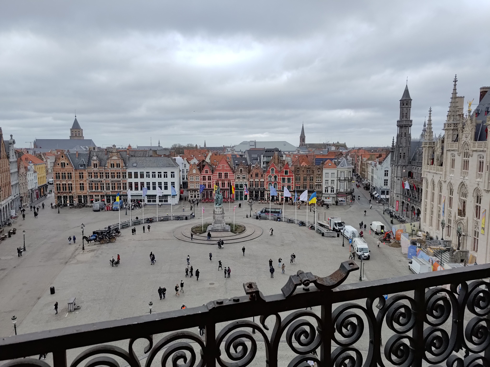
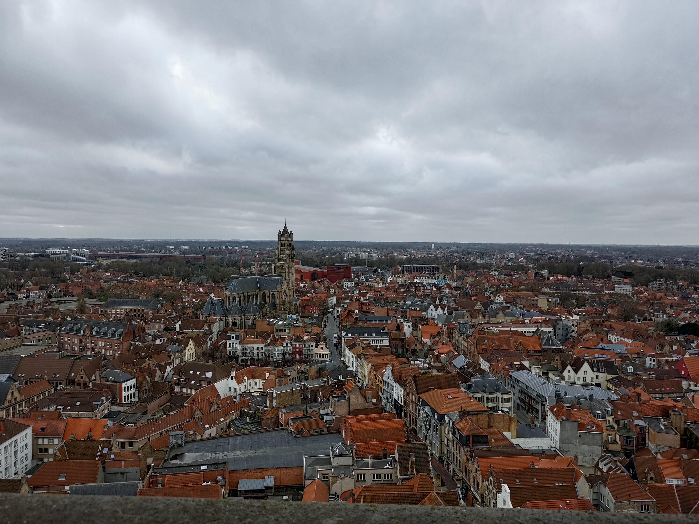

Today I went to Bruges, a beautiful city near the Belgian Atlantic coast. I woke
up a bit late (I still haven't really adjusted to the CEST timezone), but I
managed to get to Bruges by around 11 in the morning. I enjoy trains, and I got
to take the train from Bruxeles-Midi through Ghent and on to Bruges.

I'd skipped breakfast, so by the time I arrived in the city centre, I was hungry
and went to a restaurant called
[De Beurze](https://maps.app.goo.gl/Xsqv4zeMx45H98bj8). It was a cosy place,
with a little fireplace that I sat next to. I had a nice steak with salad and
fries, all while having a great view of the main square. I really enjoy the way
that they do service in Europe. Nobody comes to bug you while you're eating, but
they are attentive and you can easily flag the wait staff down if you need
anything. I don't like that you have to pay for the water, though. But it gives
me an excuse to order sparkling water since it's the same price as still.
Additionally, since the US Dollar is so strong against the Euro right now, the
prices are also very reasonable. I think it was 1.08 USD to 1 EUR while I was
there.

## Belfort

After lunch, I went across the square to Belfort (the Belfry), which is a large
bell tower. It's at the centre and it has a great view of the town and the
square below.

<table class="gallery">
<tr>
<td>

</td>
<td>

</td>
</tr>
</table>

However, the most interesting part was the way that the bells were operated.
There is a huge intricate "music box" type contraption which plays the bells.
There is a large drum with pegs in it, and when it is rotated, it plays a
sequence of 47 bells.

To get to the bells, you have to climb some very narrow and steep stairs all the
way to the top, but it is well worth it for the views and being able to watch
the bells in action.

## Wandering

After the bell tower, I continued walking around the town. It is a very
beautiful town and I really enjoyed just walking around the streets. I'm not
sure if I'd like living there considering how touristy it is, but it was very
beautiful.

<table class="gallery">
<tr>
<td>

</td>
<td>

</td>
</tr>
<tr>
<td>

</td>
<td>

</td>
</tr>
<tr>
<td>

</td>
<td>

</td>
<tr>
<td>

</td>
<td>

</td>
</tr>
</tr>
</table>

After wandering around for a while I headed back to the train and returned to my
hotel in Brussels.

I got some dinner at [YouWok](https://maps.app.goo.gl/D8t9wgdX43BUrB9z7) and
then I went over to Grand Casino Brussels for a 60€ poker tournament. It was my
first time ever doing a poker tournament, and it was quite fun. I did not do
well, but I gained some valuable experience and I think that I will try a
tournament again at some point! I re-bought into the tournament a couple times,
but after the third bullet I decided to call it a night.
