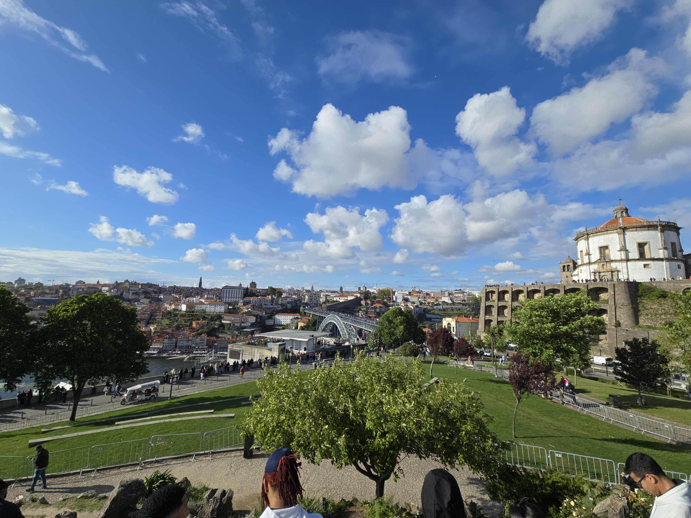

On the Saturday after the [retreat]() I did my
own sightseeing and adventuring around Porto. However, as I mentioned in my
[post about the retreat](), a
bunch of us went on a walking tour of the city on Wednesday, but since it wasn't
really meetup-related, I decided to combine the info that I got on the tour with
this post, as I think it fits better.

## Walking Tour

Our tour guide was a Porto native, and took us to some of the main sights in the
city. He started by talking about the history of Porto and the centuries-old
rivalry between Porto (which is in northern Portugal) and Lisbon (in the south).
Porto was one of the first cities liberated during the Iberian Reconquista and
became the regional seat of power for both the Catholic Church and later the
Portuguese king. Porto was so important that the country of Portugal was named
after the city. However, as the Reconquista moved south during the eleventh
through the thirteenth centuries, the power centre moved south and by 1255
became the capital of Portugal. Today, the rivalry is most evident in the
football rivalries, and in the beer that is served in each city with Super Bock
being the primary beer of Porto and Sagres being more popular in Lisbon (though
I was able to find both in Lisbon
[when I was there a few years ago]()).

One of the first stops that we made was at a McDonald's that is inside of a very
famous historic cafe. McDonalds restored the old cafe, but they had to leave the
exterior untouched, and keep most of the interior the same as well. It was a
very beautiful building, just wish that it wasn't a McDonald's :).

The next stop was at the Porto train station. The entrance is decorated with
intricate painted ceramic tiles. The main facades depict military conquests and
other historical events such as the arrival of the English king to form an
alliance with the Portuguese. Above the main murals are murals depicting the
evolution of transportation from horse and carriage to the train.



We then walked up a hill to the highest point in the city. There is a famous
church with a belltower (I went up it on Saturday) and a large square. Around
the square are multiple important buildings such as a jail that was originally
for violent criminals (they would actually perform public hangings of convicted
criminals in the square outside the jail. The jail was converted to a political
prison during the Salazar dictatorship, and after the dictatorship fell, they
converted it to a museum of photography.

On the other side of the square was a courthouse built during the dictatorship.
Outside of the building is a statue of Lady Justice, our guide pointed out that
she is not blind, her sword is out in front, not by her side, and she grasps an
unbalanced scale of justice in her hand. I'm not sure if Salazar requested this,
or if the sculptor was trying to send a subliminal message, but it serves as a
reminder of what perverted justice can cause.



Along the walking tour, we walked along many pretty streets. This one in
particular caught my eye for its vibrant colours:



## Cleric's Tower

On Saturday, after the retreat was over, I spent the day sightseeing. A was
staying at [_Residencial Bragança_](https://maps.app.goo.gl/f5UmwULLZHZtKhk97)
and it was literally a stone's throw away from the Cleric's tower and church. I
didn't know that it was so centrally located when I booked it (it was just cheap
and close to what looked like the centre).

I started my day in the late morning and naturally, the church was the first
thing that I went to go see on Saturday. The guide of the walking tour
recommended it because of the great views. Inside, there were a variety of
displays about the history of the tower. It was created by brotherhood dedicated
to helping clerics who came upon hard times whether poverty or illness. Don't
ask me why this organization needed their own church and tower, but in the
1700's they did. I'm not going to complain too much, because the church now has
the best views of all of Porto.



After enjoying the fantastic views from the tower, I went back down and walked
around the area near the tower. There was a really cool view with the tower an
iconic old tram line.



After lunch, I continued meandering around the city with the general goal of
going towards the waterfront because there are is a really cool bridge that I
wanted to see. I like wandering cities in Europe, it is fun to be able to
explore and when you see something interesting, just go and look at it. The
streets are very quaint and colourful, and actually quite hilly. I ran across a
church and went inside to look around and I wandered through a square where lots
of people were lounging out on the grass enjoying the nice weather.

<figure>
  <table class="gallery">
    <tr>
      <td>
          
        <b>A view down a narrow street in Porto</b>
      </td>
      <td>
          
        <b>A colourful, vibrant street</b>
      </td>
    </tr>
    <tr>
      <td colspan="2">
         
        <b>A nice square where people were lounging and enjoying the nice weather</b>
      </td>
    </tr>
  </table>
</figure>

Eventually I made it down to the waterfront. There is a really nice boardwalk
area with markets and restaurants. The main attraction at the centre of the
action was the double-decker bridge _Dom Luís I Bridge_. The bottom part of the
bridge is for foot and car traffic, while the upper level is for tram and foot
traffic.

<figure>
  <table class="gallery">
    <tr>
      <td>
          
        <b>The boardwalk area around the double-decker bridge</b>
      </td>
      <td>
          
        <b>A restaurant/market area just off of the boardwalk</b>
      </td>
    </tr>
  </table>
</figure>

I leisurely walked down towards the bridge and crossed on the lower deck. There
were buskers at various points all along the boardwalk on both sides of the
bridge. By this time, I was hungry for dinner (wandering around the city is hard
work :)). I went to a waterfront restaurant called _Tempêro D'Maria_ and had
steak with some port wine that Porto is famous for (it's wine fortified with
brandy). The view was fantastic from the restaurant!



I then hiked up the other side of the river bank towards a square with great
views of the city.

<figure>
  <table class="gallery">
    <tr>
      <td>
          
        <b>The bridge from the other side of the riverbank</b>
      </td>
      <td>
          
        <b>The view from the garden over towards bridge</b>
      </td>
    </tr>
  </table>
</figure>

At this point, I decided to go play some poker at a casino a few miles south of
Porto in Espinho. My justification was to try and get back on the Denver
timezone since it was morning in the states at the time. I've also been setting
aside funds for poker lately because I really enjoy the game and would like to
get better at it. I played for a few hours, and then headed back to the hotel
and packed my things in order to make my 06h30 flight back home.

---

I enjoyed Porto quite a lot. It's a really pretty city, and it is a very old
city as well. Much of Lisbon was burned down during the earthquake and
subsequent fire in 1755 and so most of the city was built after that. Porto, on
the other hand, has many older buildings. I was very fortunate to find the hotel
that I did with such a central location, and I enjoyed all of the sights
immensely.

I hope that I can return to Porto at some point in the future. It seems like
Portugal is a common retreat location for Automattic, so I think there's a
pretty decent chance that I do return at some point.
