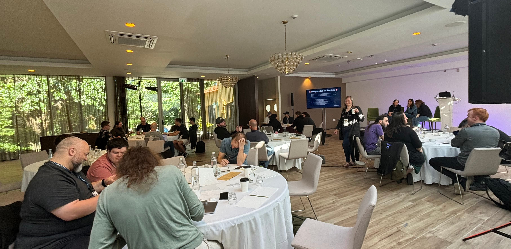

The past few weeks have been exciting for Beeper. We
[made Beeper available to everyone without a
waitlist](https://blog.beeper.com/2024/04/09/beeper-is-now-available/),
[launched a new Android app based on our own internally-built Matrix SDK written
in Go](https://blog.beeper.com/2024/04/09/how-beeper-android-works/), and
[were acquired by Automattic](https://blog.beeper.com/2024/04/09/beeper-is-joining-automattic/)
for
[$125M](https://techcrunch.com/2024/04/09/wordpress-com-owner-automattic-acquires-multi-service-messaging-app-beeper-for-125m/).
As part of the acquisition, the Beeper team is merging with the
[Texts.com](http://texts.com/) that was acquired by Automattic last year. We are
going to unify the products under the Beeper brand. All of this is only a few
months on the heels of our
[Beeper Mini launch](https://blog.beeper.com/2023/12/05/introducing-beeper-mini-get-blue-bubbles-on-android-%f0%9f%92%99/)
which brought fully end-to-end encrypted iMessage to Android devices.

Like Beeper, Automattic is a [remote-only company](https://automattic.com/about)
and so is the Texts.com team, so work retreats are the only time that we can
connect with our co-workers in-person and build stronger personal relationships
with among the team. This retreat felt especially necessary because we are
combining two teams together and we wanted to build personal relationships
across the previously separate teams.

Our destination for this retreat was Porto, Portugal. We've had a
[retreat in Portugal before](),
but not in Porto. We also have had retreats in
[Montreal](),
[Playa del Carmen](),
[Mexico City](),
[Amsterdam](), and most
recently in [Toronto]() last fall.

## The Venue

The meeting area was on the hotel grounds about a hundred yards from the front
of the hotel. It consisted of two main rooms: one with circular tables and a
stage and one with couches and chairs and an array of snacks and coffee. It was
very fancy compared to our previous retreat, which makes sense because a whole
event team had been there setting things up for a few days before our meetup.
They had nametags and swag ready for us when we arrived and there was a whole AV
setup with TVs and livestreaming equipment. They had tables set up for everyone
and a small stage in the front. This is definitely a benefit of being at a
larger company: we have actual teams that organize larger retreats. In the past,
it's mainly been Eric handling all of the logistics, which is a lot of work and
his bandwidth was not primarily dedicated to event planning.

The hotel itself was very nice as well. The room was large and luxurious and the
hotel's restaurant felt high quality for a hotel. We had breakfast every day at
the restaurant (well, we being the general "we"... I skipped breakfast a couple
days due to sleeping in too much) and they also provided lunch and a few
dinners.

## Getting to Know Everyone

In addition to the Beeper and Texts teams, there were quite a few Automatticians
in attendance who helped facilitate team-building and integration into
Automattic. My goal for the week was to have at least one memorable conversation
with everyone from the Texts.com team and get to know some fun fact about them
other than just where they're from and what they work on. I did have a
conversation with everyone, but meeting ten new people is difficult and I feel
like I need another retreat in a couple weeks just to get to know everyone
better!

We did a couple activities which encouraged everyone to mingle and talk to new
people including a variety of ice breakers on Monday, assigned random tables for
some of the meals, and [flash talks](#flash-talks). The ice breakers included an
activity that was a set of puzzles that each table had to solve, a speed
networking session, and an activity where we had to create something which
represented "Messaging at Automattic". Many of the teams used generative AI for
that activity to create images and even music about messaging at Automattic.

I also really like the assigned seating for some meals (I think it would have
been annoying if it was assigned for every meal) because it forced us to sit
with different people. I did an OK job of sitting with different people on my
own, but having the forcing function for some meals was nice. I'll describe a
couple of the most memorable conversations that I had here.

On Monday, I ate breakfast with [Kishan](https://kishan.org/) (CEO of Texts),
Javier (reverse engineering specialist at Texts) and a few people from Beeper.
Then, at lunch I sat with Rafa, Matt, and Dylan. Rafa and Dylan came from
Texts.com, and Matt transferred to the Texts.com team from another team at
Automattic (I think Tumblr). ~~We discussed~~ I blabbered about
[HTMX](https://htmx.org/) and about how I believe that more web apps should be
rendered server-side and we should generally rely less on client-side rendering.
We discussed that this trend towards server-side rendering seems to be happening
in other areas of the industry with React Server Components and other
server-side rendering optimizations for traditionally client-side rendered
frameworks.

On Wednesday, after the [walking tour](#walking-tour) we went to a winery for
dinner and I sat with [Rida](https://rida.dev/), [Skip](https://skip.house/),
and Meaghan, among others. Meaghan is on the Developer Experience team and she
shared some insights into how past acquisitions have gone from the Automattic
side of things. As I'll [talk about later](#transitioning) in the post,
Automattic's culture is different from Beeper's in many ways, but there are many
similarities as well. I think that it will be an adventure to adapt to the new
culture we find ourselves in, but I think it's a journey worth taking. In my
discussions with Rida, I learned that he was the one of the main writers behind
the scathing
[Sunbird / 'Nothing Chats' is Not Secure](https://texts.blog/2023/11/18/sunbird-security/)
blog post that the Texts.com team produced after Nothing Chat's release. It was
a masterful work of reverse engineering that was
[widely](https://www.theverge.com/2023/11/18/23966781/nothing-chats-imessage-unencrypted-sunbird-plaintext)
[reported](https://techcrunch.com/2023/11/22/sunbird-pauses-its-efforts-to-bring-imessage-to-android-amid-security-worries/)
[on](https://futurism.com/the-byte/app-texts-blue-privacy-fail) and effectively
killed Nothing Chats as a product. Skip told me that he'd actually considered
applying to Beeper since he was friends with a former employee, but decided
against it and ended up getting hired at Texts.com for his Discord reverse
engineering work. It's come full circle now and he's working on Beeper anyway!
The industry is very large, but within a niche, it seems that the degrees of
separation between people is very small.

After dinner every night, there was an open tab at the hotel bar. I went to bed
on the first three nights since I was still trying to fight the jet lag, but on
Thursday I was feeling energized enough to go over to the bar. I had a really
nice conversation with Ellie who works on
[Pocket Casts](https://pocketcasts.com/). I have used Pocket Casts for a long
time, and love the product, so it's cool to now work at the company behind the
product. I also spoke extensively with Kevin about what he looks for on resumes
for junior engineers. We don't hire any junior devs at Automattic, but he's
hired junior engineers at previous roles. (I think a big reason for not hiring
juniors is because it's very difficult for juniors to come into a remote-only
entirely asynchronous company. I learned that even the daily standup meetings
that Beeper has is rather abnormal at Automattic.) Kevin gave me some really
good tips to bring back to the
[students that I interact with at Mines]()
to improve their resumes and help explain which extracurricular activities
benefit career growth.

Friday was a travel day when most people were leaving. In the late morning, the
people who hadn't left yet were hanging out in the lobby of the hotel and Kishan
brought out his Apple Vision Pro and let all of us give it a whirl. Most of the
people left were Texts.com employees, and it was fun to try out the new
technology and interact with some of my new teammates and just nerd out about
the cool technology.

I'm definitely more extroverted than I was as a kid, but meeting people for the
first time is still difficult. However, when everyone you meet is kind and
welcoming, it makes that process so much easier. All of the
long-time-Automatticans were very accommodating and helped me understand what
working at Automattic will be like. All of the Texts.com people are very
enthusiastic about chat, and I look forward to working more closely with all of
them.

## Transitioning

As I mentioned before, there are many similarities between Automattic and
Beeper. Most obviously, we are remote-only companies, so that part of the
transition has gone very smoothly. However, over the years we have had developed
a variety of processes and a unique culture at Beeper which has many differences
to how Automattic works. I think that the cultures are very compatible, but I
think that it's going to take some time to meld the two together.

On Monday, Ronnie led a discussion about change vs. transitions. The main goal
of the discussion (as far as I could tell) was to get us to differentiate
between change (things which just happen to us and are outside of our control)
and transitions (conscious decisions to evolve processes and mindsets). Change
necessitates transitions. For us, the main change is that Beeper was acquired
and it's on us to transition to the new reality. So far, everyone at Automattic
has helped make this process as smooth as possible. Even just the fact that we
were acquired as an entire team signals to me that Automattic really wants to
invest in Beeper not only as a product, but as a team.

On Tuesday, we had a very short AMA session with the Beeper and Texts leadership
as well as Sonal who leads the Other Bets division (of which Beeper is a part).
I have confidence in the leadership team of both Beeper and Automattic, and I
see a lot of willingness from leadership to support both the development of the
Beeper product and the integration of the Beeper team into Automattic.

## Flash Talks

Part of assimilating into the Automattic culture was giving flash talks: short
four-minute talks about a topic. Everyone at the meetup had to give a flash
talk, and each day a few people gave a talk. The topics ranged from a talk about
Texts' architecture by Batuhan to a talk about The Yooper (the Upper Peninsula
of Michigan) by Josh and from a talk about running shoes by Bradley to a talk
about Minas Gerais (a state in Brazil) by Wellington. Many of the talks topics
were somewhat predictable considering the demographic: there were a few talks
about various video games (Magic and Dota come to mind) and talks about 3D
printing, hacking routers, and AI. But many others were quite surprising and
really showed the diverse personalities of the team.

A fan favourite was Adam's "Lettuce or Cabbage" flash talk where he went through
a series of pictures of cabbages or lettuces and had the audience shout out what
we thought they were. We were pretty horrible at the game. Eric also played a
game of "TV Show or Real Life: Silicon Valley Edition" where he described a
bunch of startup ideas and we had to guess if they were from the show Silicon
Valley, or from real life. It turns out that all of the ideas that he presented
were real, despite many of them sounding so outlandish that you would think that
only a TV show writer would be able to contrive such a "business"!

For my flash talk, I talked about my history with blogging. Automattic's
flagship product is WordPress, so I thought it would be fitting for me to talk
about the various blogs that I've had over the years. I started blogging when my
mom had us write about our six-week trip to Vietnam in 2010. The original posts
are on [an old Blogspot blog](http://basheracademy.blogspot.com/) and you can
actually find them [on this site]() as
well. I had a [WordPress blog](https://sumnerevans.wordpress.com) for a few
years, and I've had this blog in various forms since around 2017 with the most
recent large change being in 2020. It was fun for me to look back on my blogging
history and remember the reasons I do this: I want to document the good times in
life so that I always remember that I have so much to be grateful for.



## Walking Tour

On Wednesday, a large group of us went on a walking tour of the city. Our tour
guide was a Porto native, and took us to some of the main sights in the city.
I'm going to defer my discussion of the things that he talked about to my next
post about my extra day in Portugal sightseeing, as I want to keep this post
focused on the meetup itself, but I'll post a few photos of our group right
before and right after the tour.





## Planning a Glorious Beeper Future

During the week, we had many co-working sessions where the individual teams got
together and planned out a variety of initiatives. As Brad described in our
[How Beeper Android Works](https://blog.beeper.com/2024/04/09/how-beeper-android-works/)
blog post, we are building a core Go library for our clients. The Android app is
already using it and the desktop a iOS teams began work on integrating it while
also combining the Beeper and Texts codebases.

We are also building towards more local bridges like the experimental Signal
bridge that we announced in that blog post. As part of this initiative, the team
I'm on (the Platform team) kicked off a large refactor of all of our bridges to
reduce code duplication and increase standardization of features across the
bridges. The Platform team also mapped out plans for increasing the reliability
of Beeper's server infrastructure while reducing costs.

I'm excited about the future we are building towards. Our vision has not
changed: we want to build the best chat app in the world. The combined Beeper
and Texts teams have all of the best chat network reverse engineers, and we have
a team that can give any team in the chat space a run for their money. Everyone
on the team is highly competent and motivated towards the goal of de-siloing the
chat landscape. But in order to de-silo the chat landscape, we must de-silo
ourselves. This retreat was a big step towards that goal.

It's cliche to say, but I truly believe that our combined Beeper/Texts team is
greater than the sum of its parts. The teams have been working on similar
products for a long time, but now we are joining forces. Combining the knowledge
of the two teams will take time, but I think that we will emerge from this
transition as a strong, unified team ready to take on any challenge we face.
