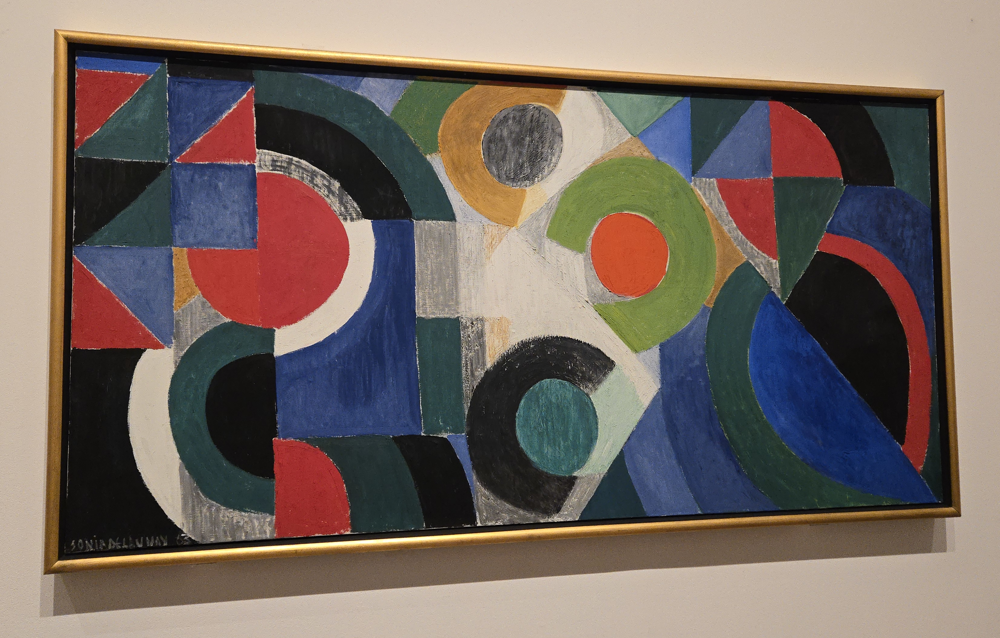

I once again am making a trip across the pond for FOSDEM. This time, instead of
flying to Brussels, I chose to fly to London a few days early and then take the
Eurostar to Brussels. The nice thing about this itinerary is that I was able to
take a direct flight from Denver to London, Heathrow. The flight was not very
full, and I ended up with a whole row to myself!

I arrived in London around 10:30 in the morning. Getting to my hotel was a
matter of taking a few underground trains to the Lambeth North station. The Tube
is so easy to navigate, and my hotel
([Point A London, Westminster](https://maps.app.goo.gl/AFWHcWM8eihLX8ns6)) was
literally right across the street from the Lambeth North station. I arrived at
around noon, and was delighted to discover that my room was already available. I
was quite tired after the long trip, and so I took a nap for about an hour.

At this point, I was pretty hungry. I ventured out into the drizzle to find a
restaurant for lunch. I found
[Enough to Feed an Elephant](https://maps.app.goo.gl/aahu8TSXG2MiDLf27) which
has good ratings, but I was unimpressed with the service (it was very slow) and
the food was not what I expected (so that's on me). It was calories though, and
I felt somewhat rejuvenated after eating.

## Tate Modern

After lunch, I headed over to the
[Tate Modern](https://www.tate.org.uk/visit/tate-modern). I'm not really a big
fan of modern art, but I figured I should go to up my elite street cred. I
stayed for a little over an hour before I got bored and decided to do something
else.

Here were a couple of things in the museum that I thought were kinda cool.

<table class="gallery">
<tr>
<td width="70%">

</td>
<td width="30%">

</td>
</tr>
</table>

## St. Paul's Cathedral

The Tate Modern is right across the river from St. Paul's Cathedral, so I looked
to see if there was a church service going on. There was a Sunday evening
service happening, so I went and attended it. You can't take pictures during the
service, but it was a nice service right under the dome.

I was still quite tired after my travel for the day, so I took the Tube back to
Lambeth North, found some food and then turned in for the night.



## The British Museum

On Monday, I slept in and then I went to the British Museum, arriving around
11:30. I've been to the British Museum four times I think, and every time I find
something new that I hadn't seen before. This time, the coolest thing was the
Enlightenment Gallery which had a bunch of artefacts from the Enlightenment
period. There were many old books on the shelves. Due to the number of tourists,
they have plexiglass in front of them, but I thought it was cool to think about
how much knowledge is stored in those manuscripts!



## The Transport Museum

After visiting the British Museum, I went to
[Menya Ramen House](https://maps.app.goo.gl/LGZpeN4Y7drLG5zZA) for lunch and
then walked to the [London Transport Museum](https://www.ltmuseum.co.uk/).
London is famous for two iconic public transit infrastructures: the London
Underground and the red double-decker buses. The museum had exhibits about the
history of the buses and undergrounds and how transit has expanded throughout
the decades. But I think the most interesting exhibit was a comparison of photos
from the Blitz of WWII and photos from Kyiv during the ongoing war with Russia.





## The National Gallery

On Tuesday morning, I went to the National Gallery. I'm not much of an art
museum person, but just like with the Tate Modern, I figured it would boost my
elite street cred. My favourite kinds of paintings are landscapes.

<table class="gallery">
<tr>
<td>

</td>
<td>

</td>
<td>

</td>
</tr>
<tr>
<td>

</td>
<td>

</td>
<td>

</td>
</tr>
</table>

I ate an overpriced, but pretty good, lunch at the museum cafe before heading
back to my hotel.

## Imperial War Museum

The Imperial War Museum was close to my hotel, so after a few minutes relaxing,
I walked through the drizzle over to the museum. I only had time to go through
the floor dedicated to WWI. It was sobering to think about how many casualties
were suffered by both sides. The casualty figures in the massive pitched battles
like the Somme, Verdun, and Ypres are horrifying. As I walked around the
exhibit, I thought about the soldiers in Ukraine who are fighting a very similar
static trench war right now. I'm so glad that we have a president who believes
that peace is better than war and is working to stop the fighting.

## The Shard

On Wednesday, I visited the Shard. The tallest building in Western Europe. There
is an enclosed viewing area and a terrace around floor 70 with views of all of
London. You have to take two elevators to get to the enclosed viewing area, and
then you have to go up more stairs or an elevator to get to the terrace which is
the highest publicly accessible floor.

There were two guides of sorts walking around and answering questions, and one
of them did a short presentation on the terrace about the history of the Shard
and interesting facts about it. A few things that I thought were especially
interesting were:

- There was a British architect that wanted the contract to build a building
  where the Shard now stands. He didn't get the contract. Just recently, he
  built a skyscraper in Warsaw that is exactly 1 foot taller than the Shard just
  to spite them.
- The Shard is designed to look incomplete, like it's trying to reach its full
  height. They can't go taller because of airspace requirements around Heathrow.
- The Shard was designed to be transit-first: it's located on top of a train
  station, its closer to London Bridge Station than London Bridge itself, and
  there's a bus stop at the base as well.

<table class="gallery">
<tr>
<td>

</td>
<td>

</td>
</tr>
<tr>
<td>

</td>
<td>

</td>
</tr>
</table>

## Eurostar

After visiting the Shard, I headed up to London St. Pancras International
Station to take the Eurostar to Brussels. I took the Eurostar From Paris to
London
[in 2022](), but
this was my first time leaving out of London.

Getting on the train was very easy. Passport control in Europe is very
streamlined for most passports. All you have to do is scan your passport and
they do biometric verification with a picture. I wish that the US Border Control
implemented something like this. We already have most of the technology
available for Global Entry, so there is no reason for us to not allow a much
more streamlined border control process for citizens and nationals from
countries that don't require a visa. But I digress.

I arrived in Brussels Midi and took transit to my hotel. Brussels is fairly well
connected, and my hotel was a hundred metres away from a tram stop making it
very easy for me to get to the hotel. By this time, I was very tired from
travelling and after dinner, I headed to bed.
