My plane from Dulles arrived close to on time, but the immigration queue was
very long. The new ETIAS requirements seem to be making the border check process
somewhat longer than before. In addition to telling the border agent my business
and when I was leaving, I had to provide a fingerprint scan. I really do not
know what the purpose is, but hopefully it helps them track and prevent illegal
immigration (although being Europe, I'm doubtful).

After we landed, I looked at how to get to the Automium and
[it turns out that it is closed]() so
I had to change plans. I went down to the train station under the airport (gotta
love European public transit infrastructure) and looked at the departure board.
I saw there was a train to Antwerp, and after a quick search on Google Maps, it
turns out the train only takes ~30 minutes, so I booked a ticket and got on.

The Antwerpen-Centraal station is a very ornate train station.

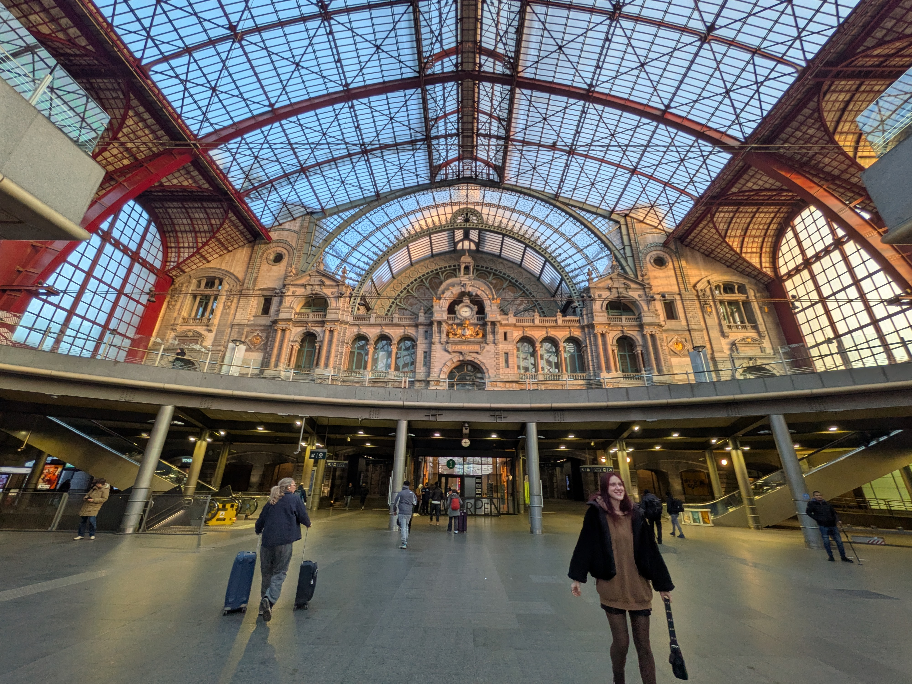

I decided to walk towards the river. There were some nice streets and
architecture along the way.

<table class="gallery">
<tr>
<td>

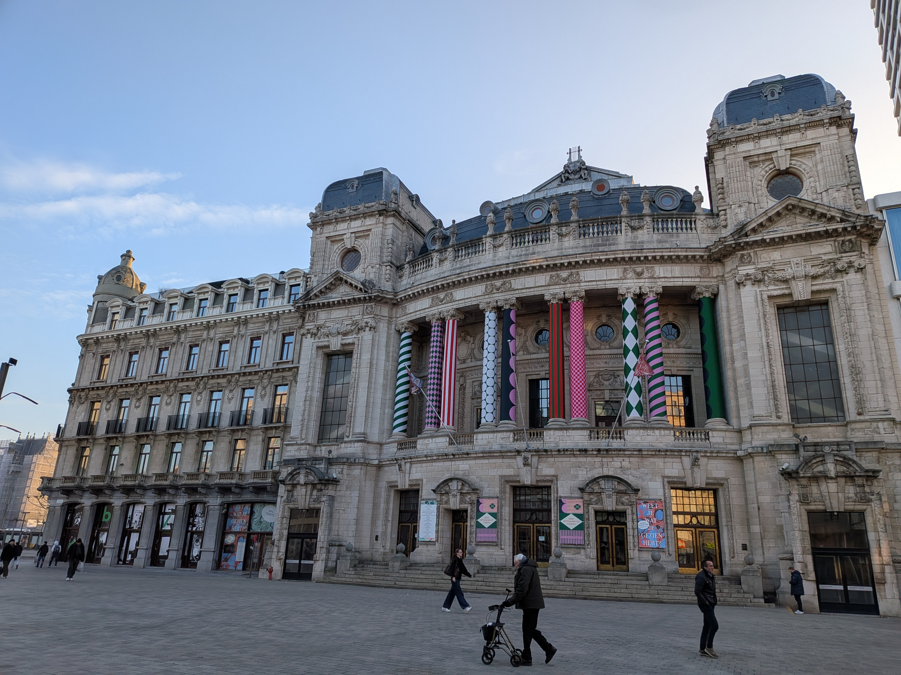

</td>
<td>

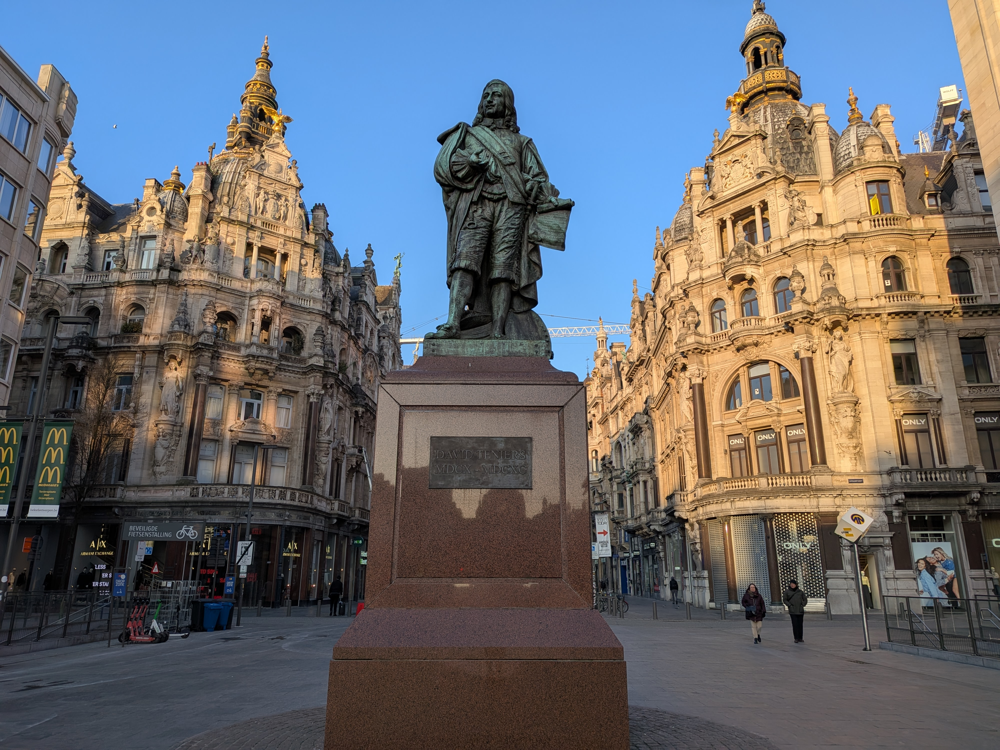

</td>
</tr>
</table>

However, the most prominent aspect of the skyline was the Cathedral, so I walked
towards it. When I arrived, it was just before the Sunday morning mass. I forgot
it was Sunday (I left home on Saturday, but of course there was a date change
due to how long I was travelling). I attended the service, and couldn't
understand anything because it was in Dutch. They had an organist playing for
the mass, and it was very beautiful.

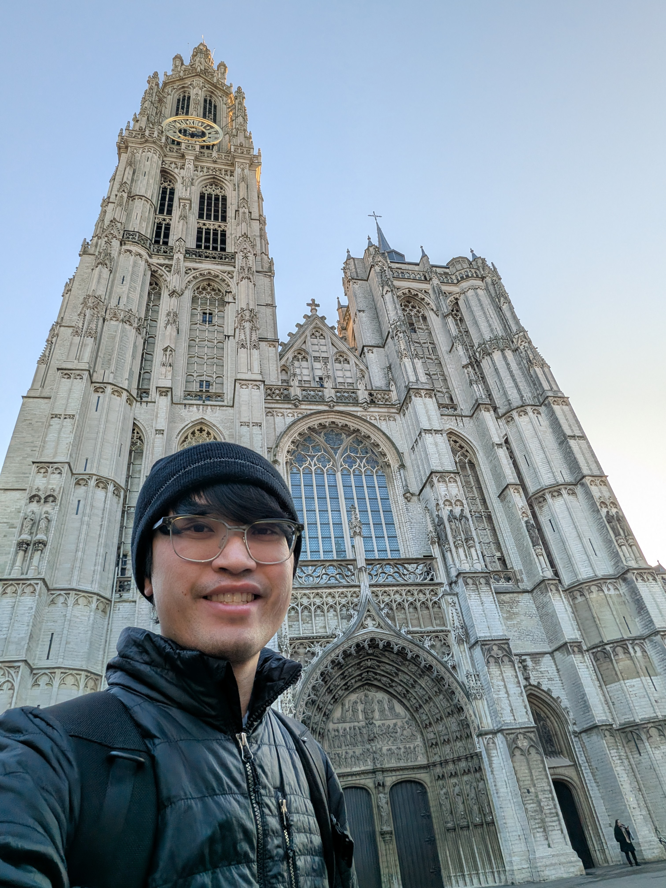

After the service, I continued walking towards the Het Steen castle, and saw
some other cool squares and buildings.

<table class="gallery">
<tr>
<td>

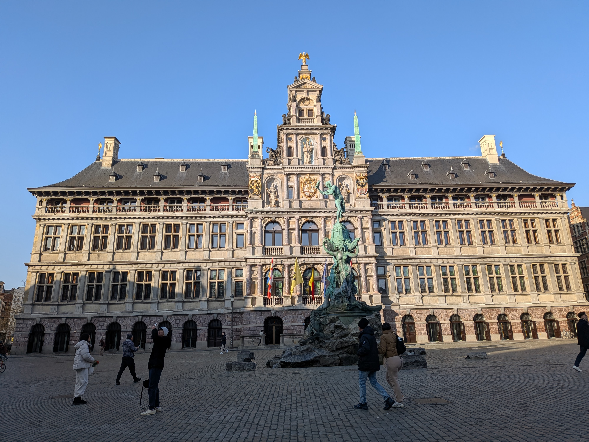

</td>
<td>

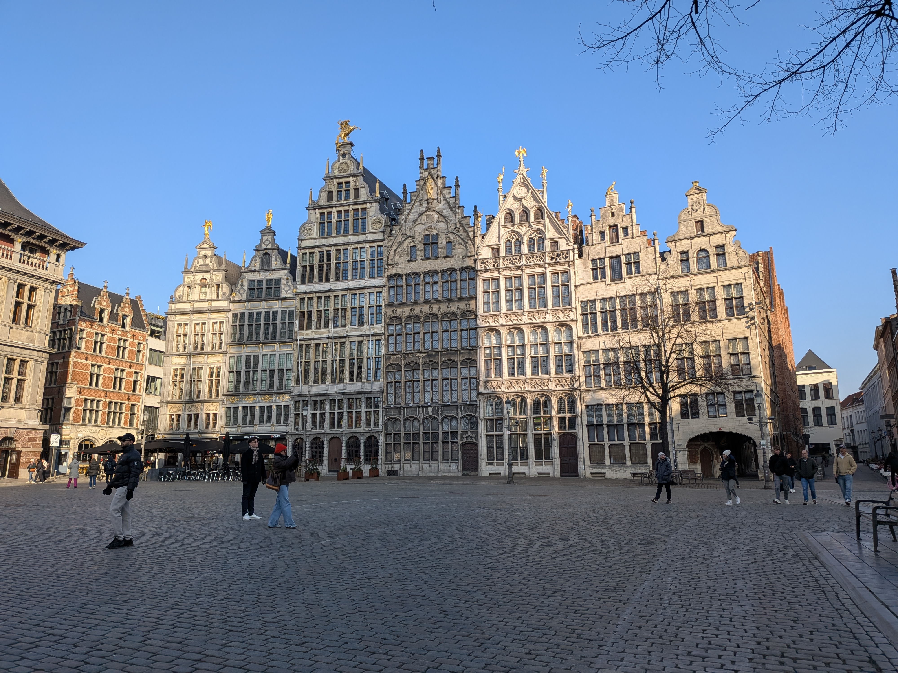

</td>
<td>

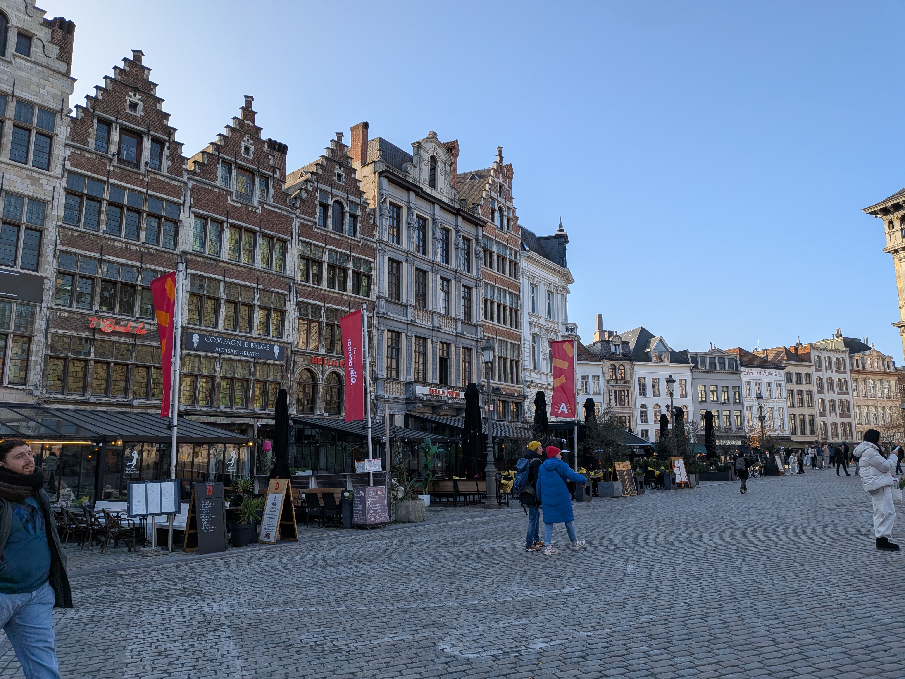

</td>
<td>

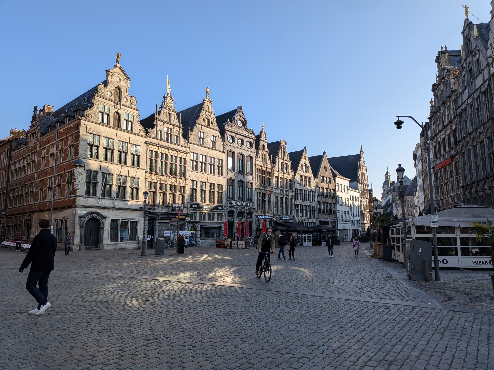

</td>
</tr>
</table>

The Het Steen castle was underwhelming, but it was nice to get out of the cold
for a few minutes.

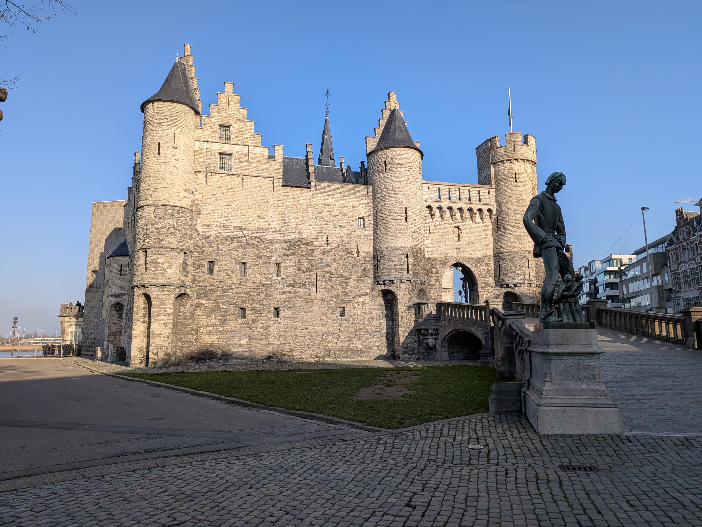

By this time, it was lunchtime, so I went and had some ramen. Definitely not a
Belgian delicacy, but it fit the weather. Then, I walked back to the train
station to go back to the airport.

<table class="gallery">
<tr>
<td>

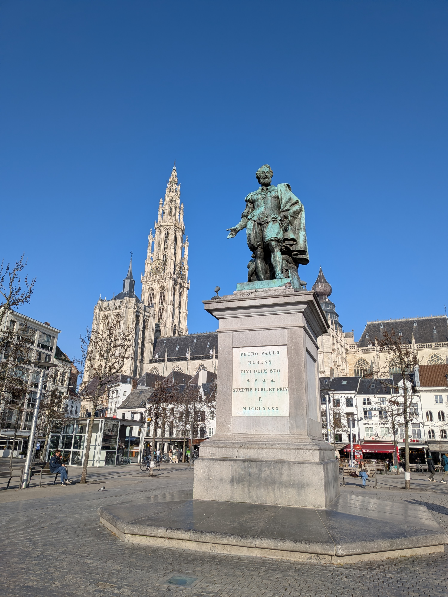

</td>
<td>

</td>
<td>

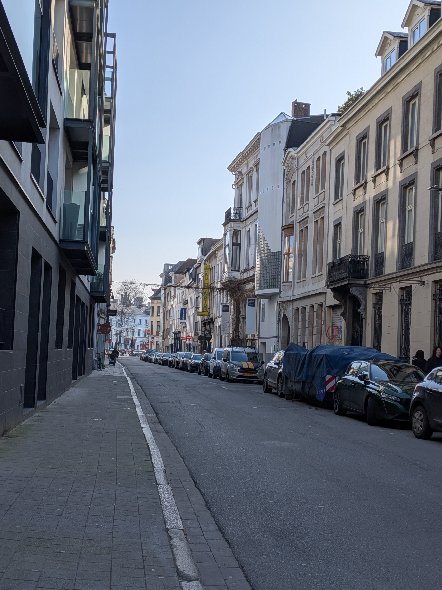

</td>
<td>

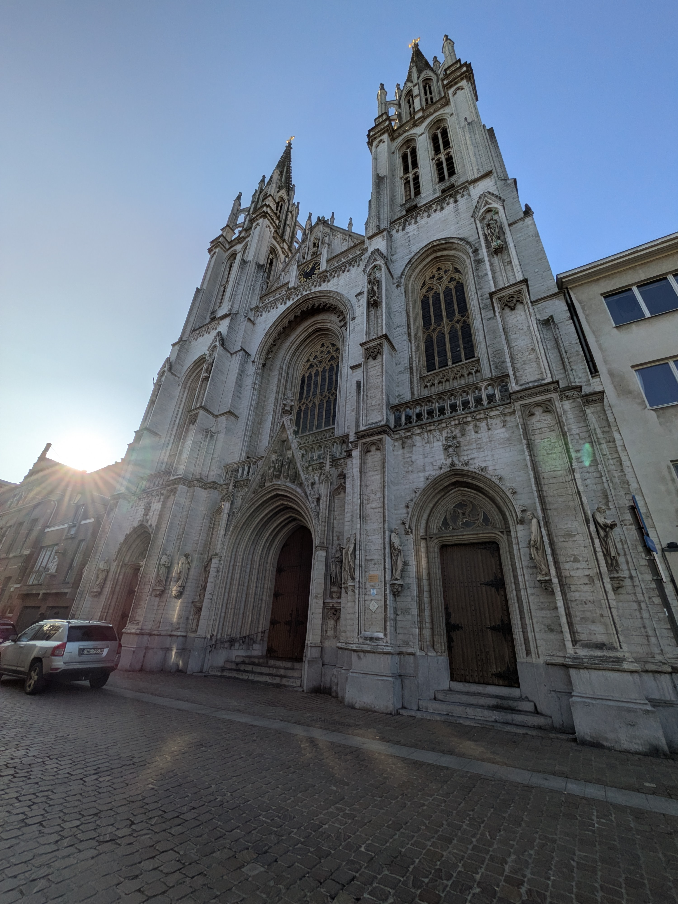

</td>
<td>

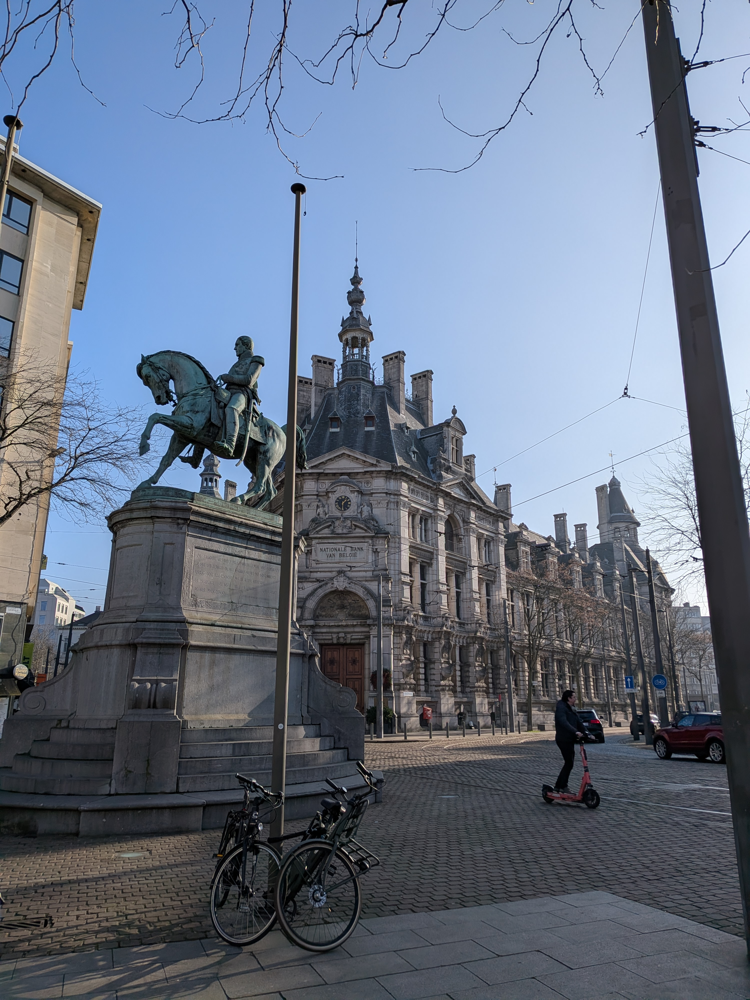

</td>
</tr>
</table>

Security and getting to my gate at the airport was easy, and the flight was
uneventful. Conveniently, the middle seat in my row was open (there were quite a
few rows with this situation). I was relieved, as it meant that I would not end
up with coffee spilled on me this flight. I slept through most of it.

Once I arrived in Vienna, I had to figure out what train to use to get to my
hostel. The City Airport Train (CAT) was heavily advertised, so I knew that was
probably not the best deal. I looked it up, and it's a whole 10 EUR more
expensive than the regional S7 train. So naturally I took the S7.

The next task was figuring out how to go watch the AFC Championship game. I
found a bar that was showing the game. There were eight or so people who were
watching the game. Obviously, the result sucked, but it was fun to be able to
watch the game. At the same time as AFC game, there was a AC Milan game and
there was a large group of around 20 fans watching the game. When Milan scored,
one of the most boisterous ones led them in a cheer ending with the team anthem.

It was midnight when the game ended, so I went to the hostel to go to bed. I'm
staying at [Wombat's City Hostel Vienna](https://www.wombats-hostels.com). The
room I am in has eight beds, and is actually two levels. My locker is upstairs,
and I took one of the beds up there as well. There is plenty of room, and there
is an en-suite bathroom to the room. There is a common area and a bar, so I will
have to check that out at some point.

I saw that there is a free walking tour from the hostel tomorrow at 10:30, so I
think I'll try to go to that.
