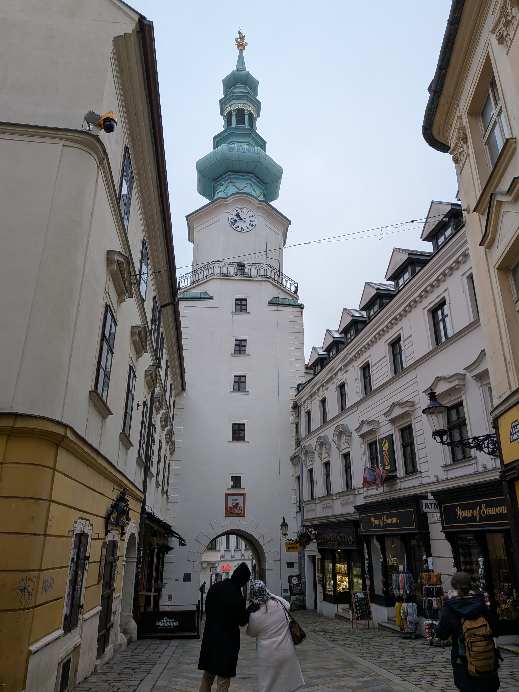
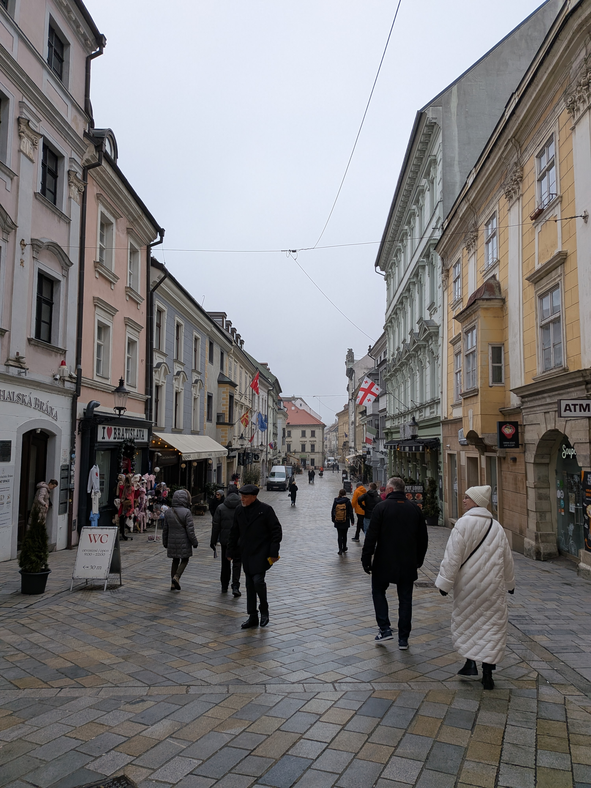
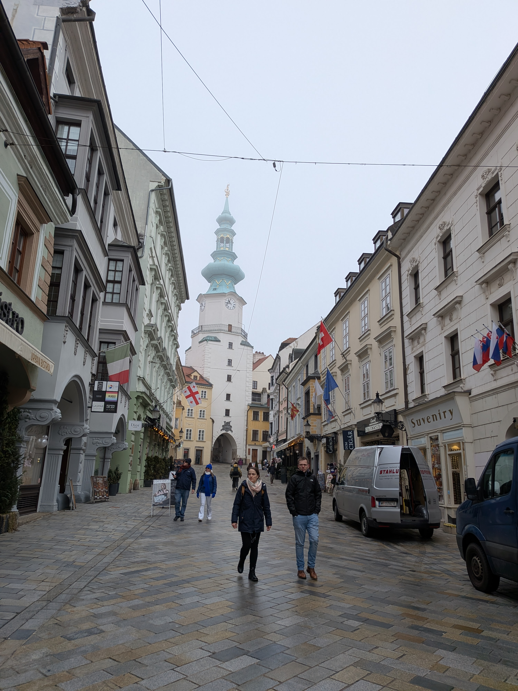
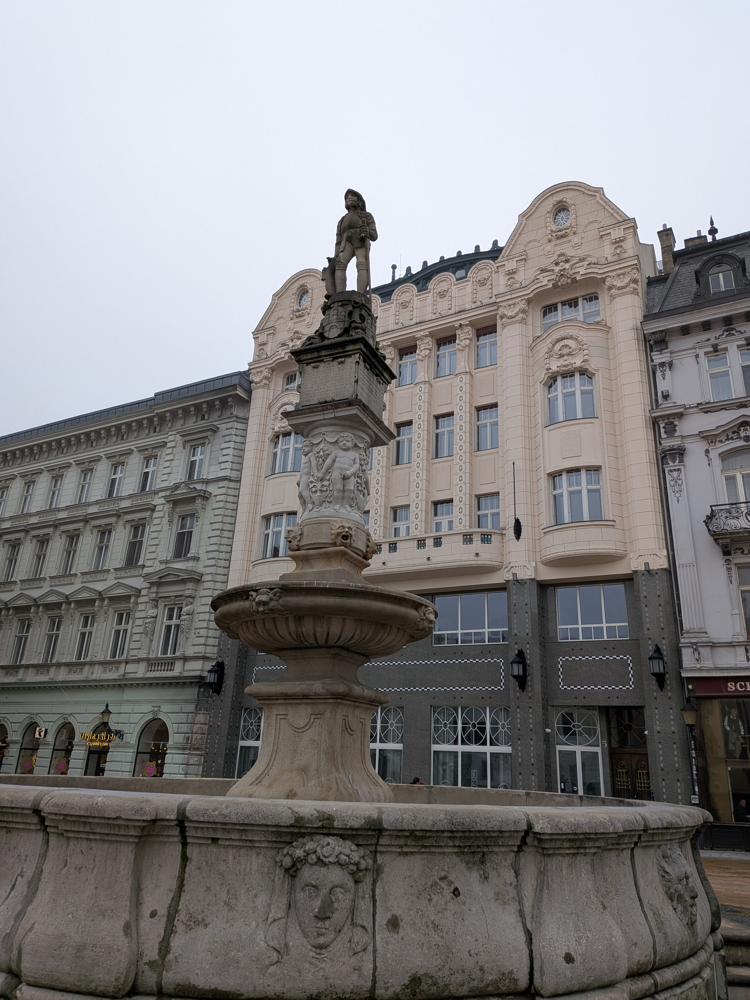
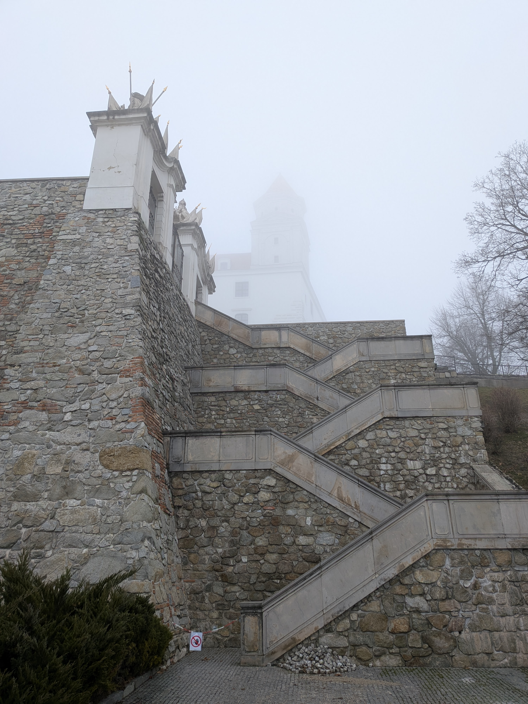
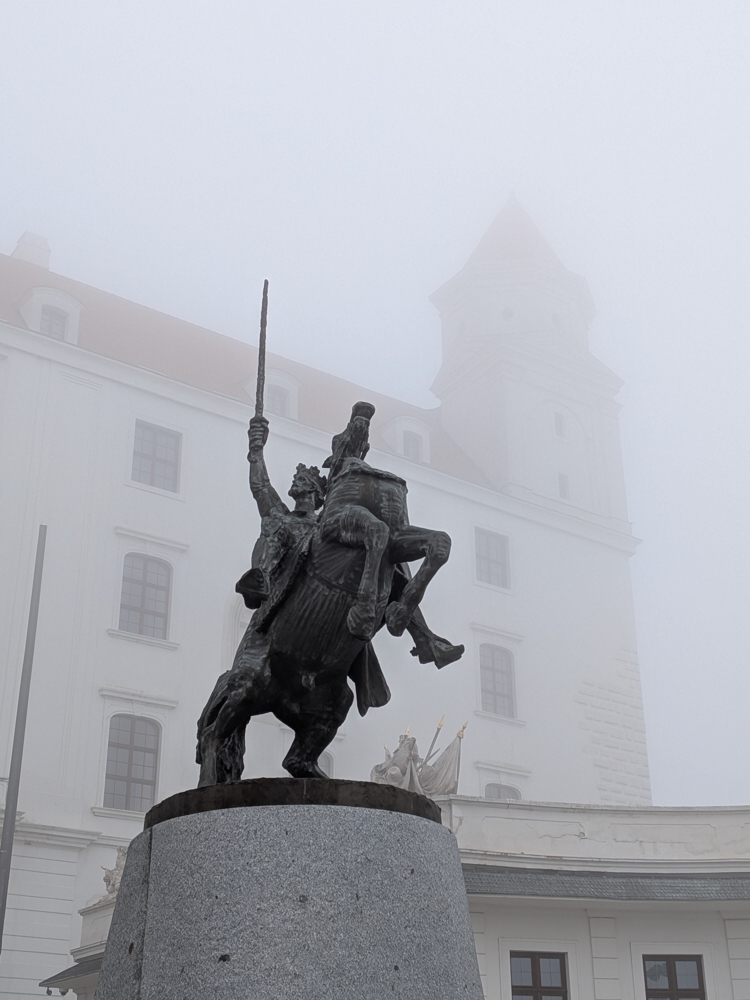
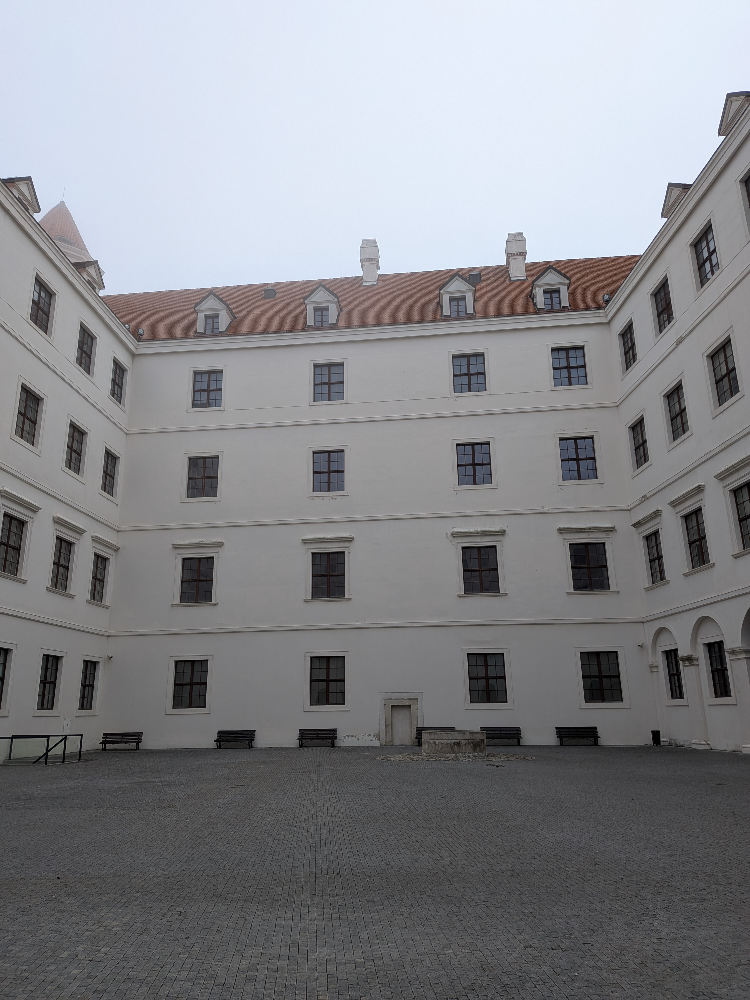
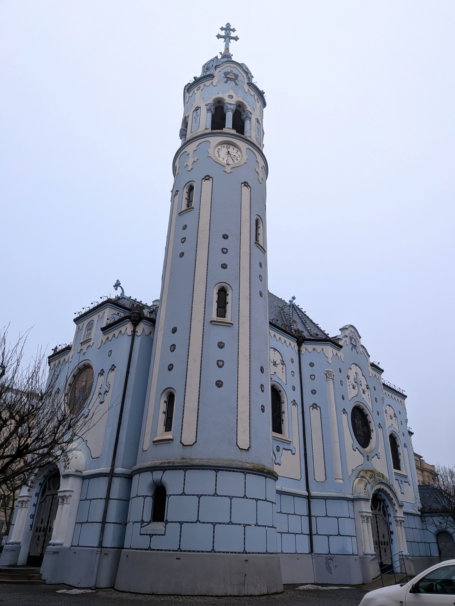

This morning, I met Bodie and Georgia at around 08:30 to head to Bratislava.
There were a few others who where planning on coming as well, but they slept in
too long.

We walked to the Vienna Main Station and took the REX 8 to Bratislava. An hour
later, we arrived in Bratislava and started walking towards the old town. The
old town seems like it used to be a walled city, and it is now a really nice
pedestrian area.

Then, we headed up to Bratislava Castle. Unfortunately, the exhibits are closed
on Tuesdays, but we were able to walk around the grounds of the castle which was
pretty cool. It's located on a hill that ostensibly overlooks the Danube. I was
unable to confirm this, as the fog was so thick we couldn't even see the
riverbank. I'm sure the views were probably spectacular, though.

After wandering the castle grounds for a bit, we headed back down to the old
town and found a [restaurant](https://maps.app.goo.gl/7qDzhmyvmFAH5JwR9) that
served traditional Slovak fare. I got a dish with pierogies, gnocchi with bacon
and sausage and sauerkraut. It was quite good, and the portion was very large so
I was quite full after that meal.

It was overcast, and kinda cold, so we figured that inside activities would be
in order. We decided to go to the Slovak National Gallery. There was a
children's book illustrations exhibit where they featured award-winning
illustrations from countries all over the world. There were also exhibits of
pieces from a variety of time periods from the middle ages all the way to modern
art.

We got art-ed out after about an hour and a half. The last attraction we visited
was the Blue Church. It was very blue. The white balance on my phone camera got
all confused due to how blue it was.

We then proceeded at a relatively leisurely pace to the train station to head
back to Vienna. I slept a bit on the way back to Vienna, and once back at the
hostel, I went back to my bed and took another nap.

I really appreciated being able to go to Bratisava with some other people. It
was very much not tourist season, so the town felt kinda dead at times. It was
nice to get to know Georgia and Bodie a bit better and have some company on the
journey.

After my nap, I went down to the bar and had a few drinks with the group that
had formed from the walking tour yesterday. Tomorrow, I'm going to go to Brno to
visit the Austerlitz battlefield on my way to Prague.
