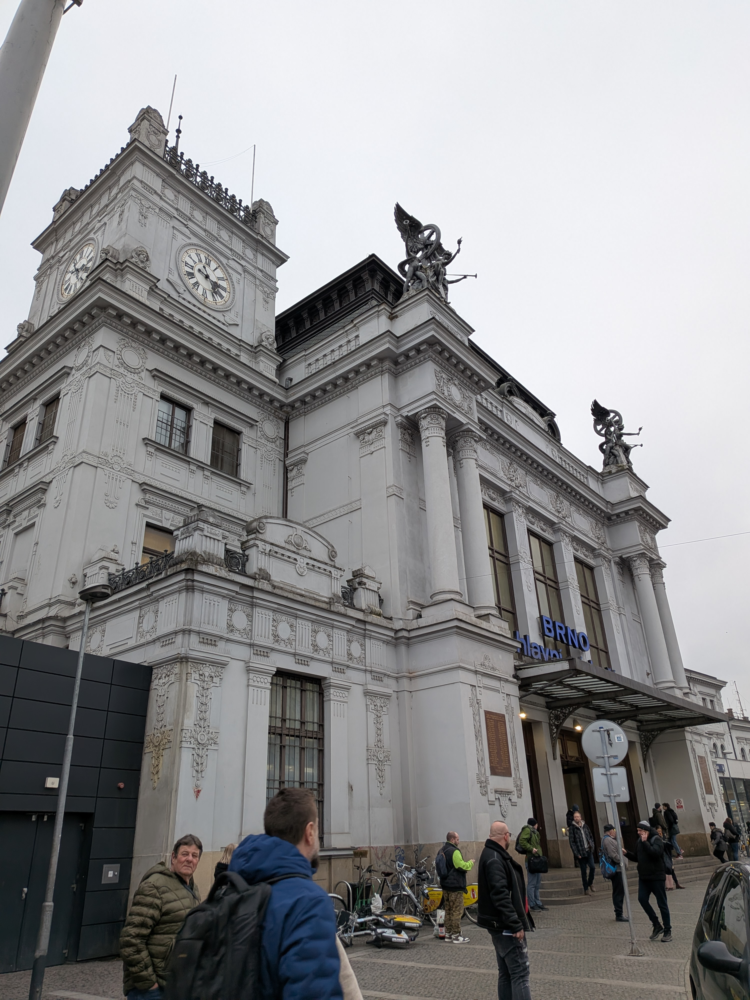
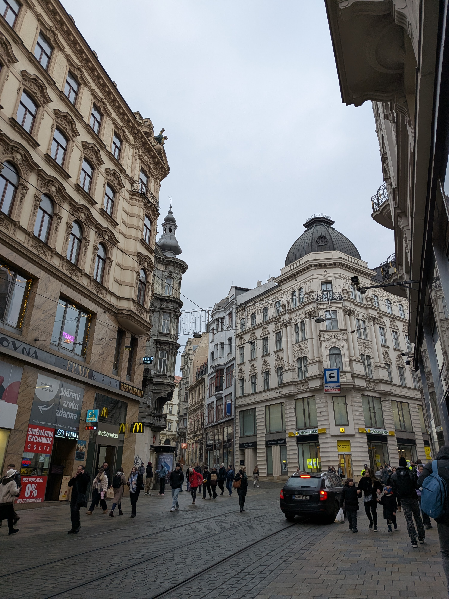
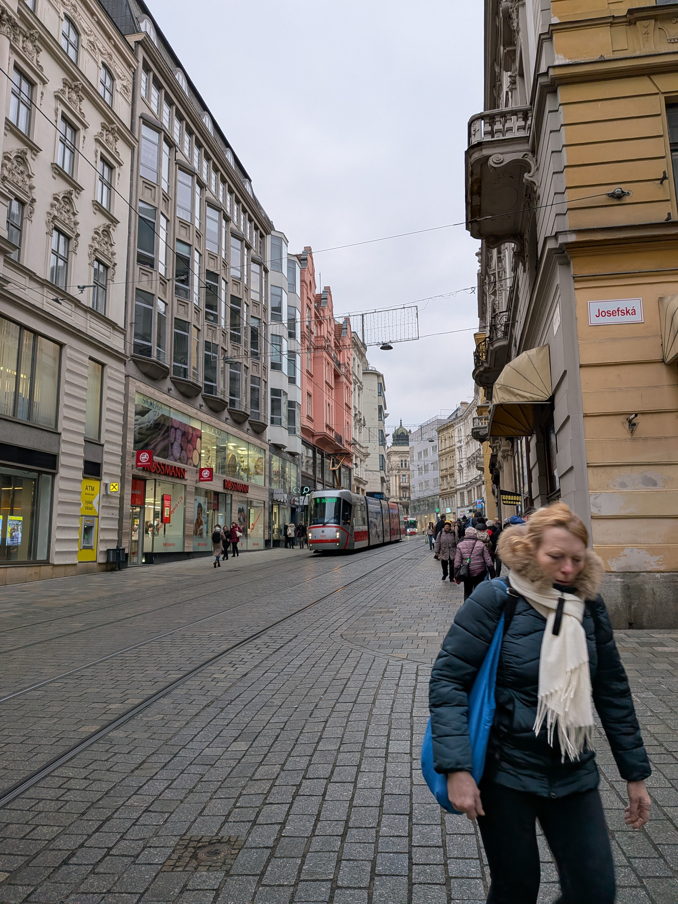
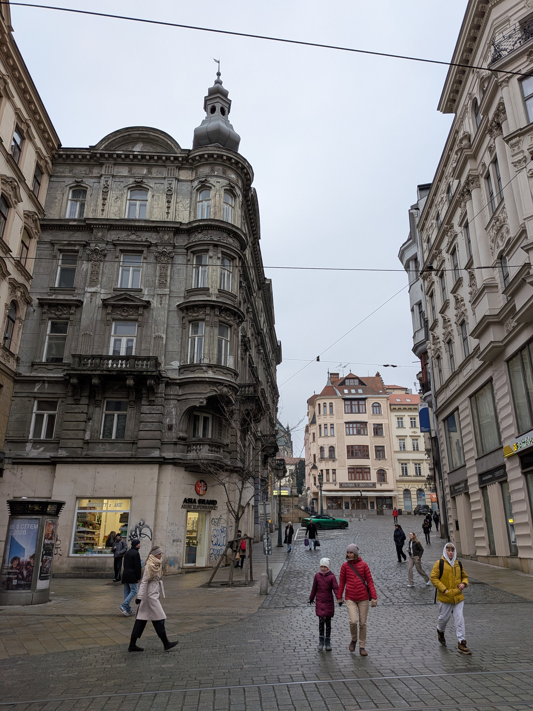
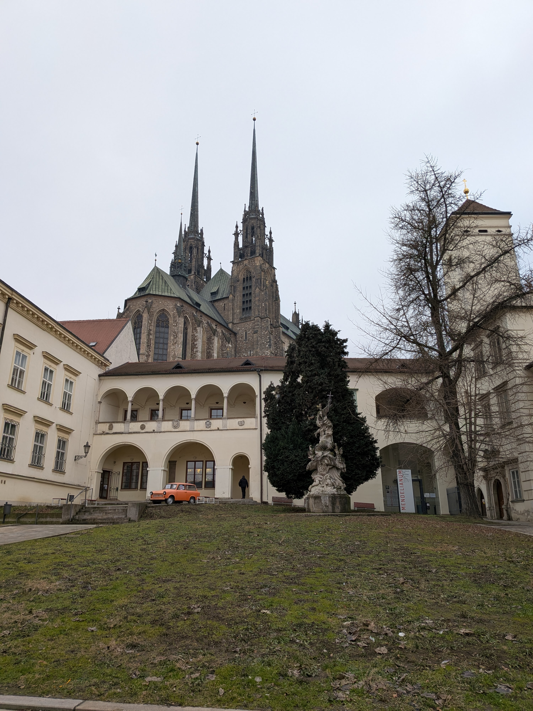
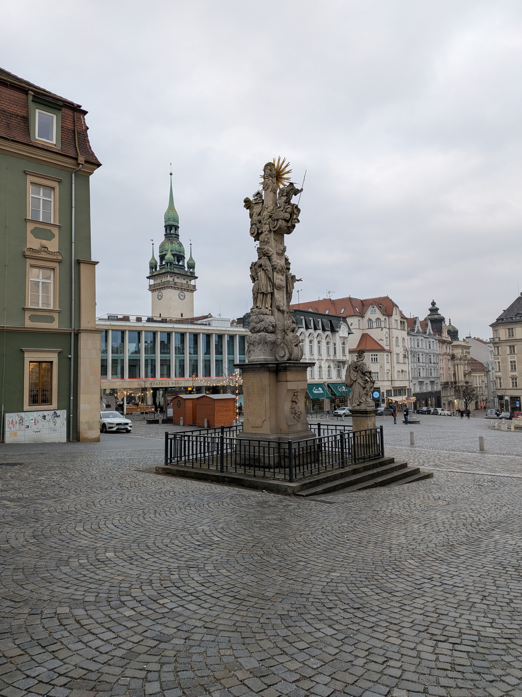
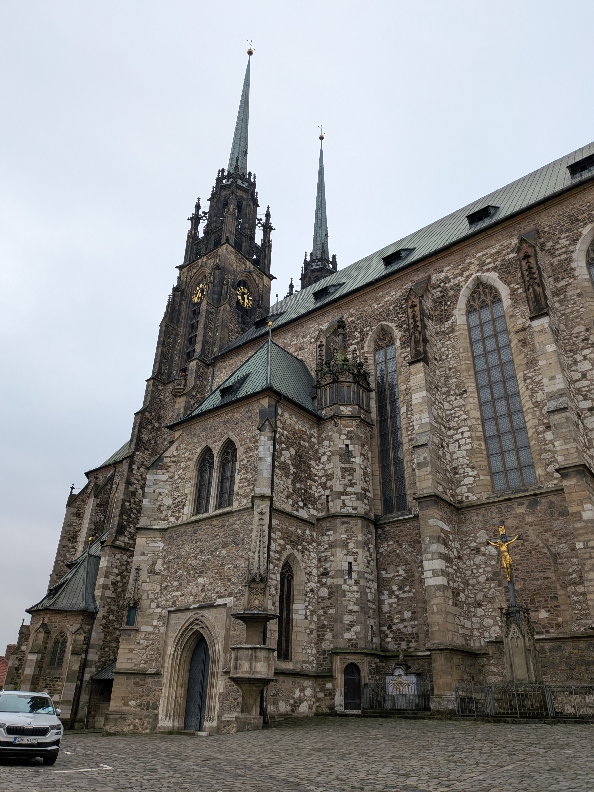
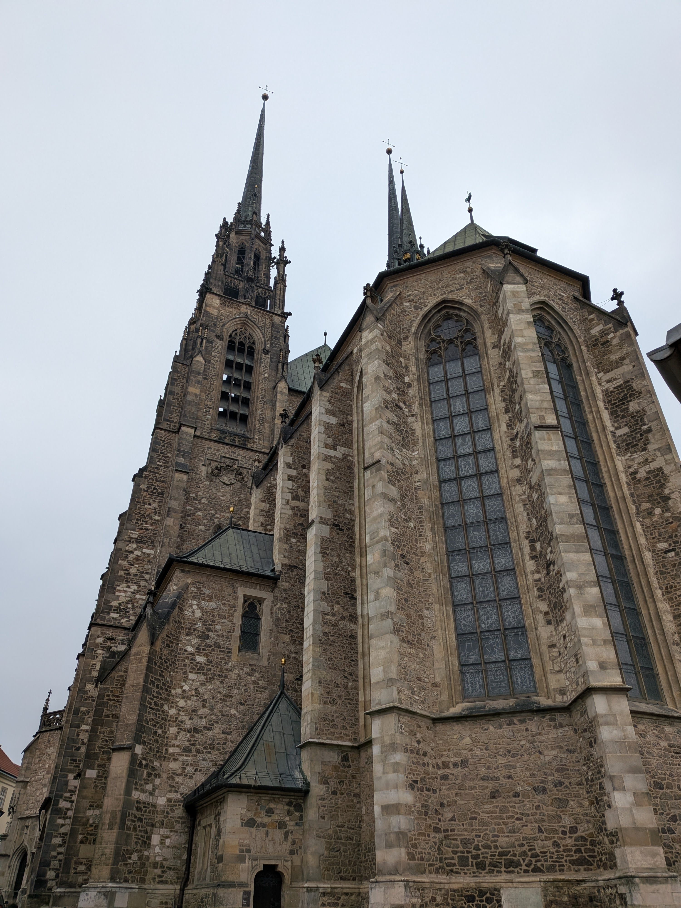

This morning, I left Vienna for Prague, and on the way I went to Brno. Brno is
very near the Austerlitz, Napoleon's best battlefield masterpiece. After
visiting Waterloo (the site of Napoleon's ultimate defeat) the last
[two]()
[years]() I figured that it was
only fair to go see the site of his greatest victory.

I woke up in time to get to the Vienna Main Station in time for the REX 1 at
09:07 towards Breclav for my connection to Brno. Unfortunately, the train was
cancelled! I had to wait an hour until the 10:07 train. The train was a regional
train, and was very slow. It stopped so often. We arrived late in Breclav, and I
ended up getting on the wrong train. I ended up on a Regiojet instead of
whatever rail line I was supposed to be on. When the conductor came around, I
had to pay for the Regiojet train segment. It was luckily not that expensive.
The Regiojet was also a pretty good train and it was direct from Breclav to
Brno. When I arrived in Brno, it was already nearly 13h and the public transit
to the Austerlitz battlefield museum was off-phase, so I took a Bolt.



There is a large monument to the dead from both sides of the battle. It's
located on the Pratzen Heights which played a critical role in the battle.
Additionally, there is a museum on right next to the monument. It's a pretty
good museum, despite the small size. It was better than the museum at Waterloo
in my opinion, as it accurately described the events which precipitated the
battle. It described the troop movements, and sequence of events which resulted
in Napoleon's rout of the entire combined Austro-Russian army from the field.
There was a cool 3D map of the battlefield with a projected movie which showed
the troop movements.

Unfortunately, the observation deck was closed due to the poor weather so I went
outside and looked around at the battlefield. Fortunately, the Pratzen Heights
is the highest point in the vicinity (hence why it played such a critical role
in the battle) and so I was able to view most of the important points of the
battlefield. The view was quite foggy, though, which obscured the view of the
battlefield. The fog added to the effect since Austerlitz was a winter affair
and fog played a large role in obscuring Napoleon's troop positions. So in a
way, the fog gave the full "Austerlitz" experience.

The Austerlitz battlefield is quite large, spanning multiple towns in the area.
From one side of the open area at the top of the Pratzen heights, I was able to
see Telnice and Sokolnice which constituted Napoleon's right flank. This was the
area the allied army attempted to crush so that they could turn Napoleon's
flank. Despite taking the villages, the allies never were able to press their
advantage during the battle. They met stiff resistance from the garrisoned
defenders, and well-timed reinforcement from Davout's III Corps which had
force-marched from Vienna held the right flank all day.

From the other side of the hill, I was able to see all the way to the town of
Blazovice. This town was the southern end of the northern sector of the
battlefield, and saw a successful counter-attack by the French late in the day
forcing the allies from the field. In that same direction, I was able to see the
town of Prace (Pratzen) after which the Pratzen heights are named. It did not
play a strategic role in the battle, besides being near the highly-strategic
hill which it gave its name to.

The fog obscured most of Slapanice and entirely obscured the hills north of the
town. This was just like the actual battle, where Napoleon's troop deployment in
that area remained obscured when the allies started their advance on Napoleon's
right flank. After the mist cleared, it was from this area, towards the Pratzen
Heights where the main thrust of Napoleon's attack came. The arrival of a large
mass of troops attacking up the centre of the battlefield took the allies by
surprise, but saw heavy fighting through the morning until the early afternoon.
But by 14:00, the heights were secured, and it was Napoleon who was able to turn
his troops south. This allowed him to join his still-heavily-engaged right flank
in a pincer movement which routed the allied left. The allies retreated in
disarray, and despite what you might think from watching the Ridley Scott film,
modern scholarship agrees that relatively few soldiers died escaping across the
ice of the lakes.

If you are interested in military history, I recommend this YouTube video from
[Epic History](https://www.youtube.com/@EpichistoryTv) which explains the battle
in a much more thorough way than I did here.

  
 Napoleonic Wars: Battle of Austerlitz 1805

  

After visiting the monument, I took the bus back to Brno and walked towards the
most prominent feature on the skyline: the Cathedral of St. Peter and Paul (they
were really covering all their bases there).

I was happy to learn that you can visit the tower in the cathedral for great
views of the city.

By that point, I was pretty hungry so I wandered around trying to find a good
place to eat. I found a restaurant that had some Czech fare. I don't really know
what I got, but it was good.

I went back to the train station and got a ticket to the Regiojet to Prague. I
managed to get on the correct train this time, but about an hour and a half into
the ride, we stopped on the tracks. The conductor came on the intercom and
informed us that there was an accident on the tracks and we would be delayed an
hour to Prague. Once we finally got to the Prague train station, getting to my
hostel was pretty easy, but it was quite late and I went straight to bed.
