This morning, I woke up in time for the walking tour. There were about ten of us
from the hostel in the group. Our guide was a woman named Katerina (not sure
about the spelling). She took us from the hostel, through the Naschmarkt (an
extensive outdoor market area), and towards the city centre. Along the way, she
pointed out a variety of the shops along the market including various
restaurants, wineries, and beer houses.

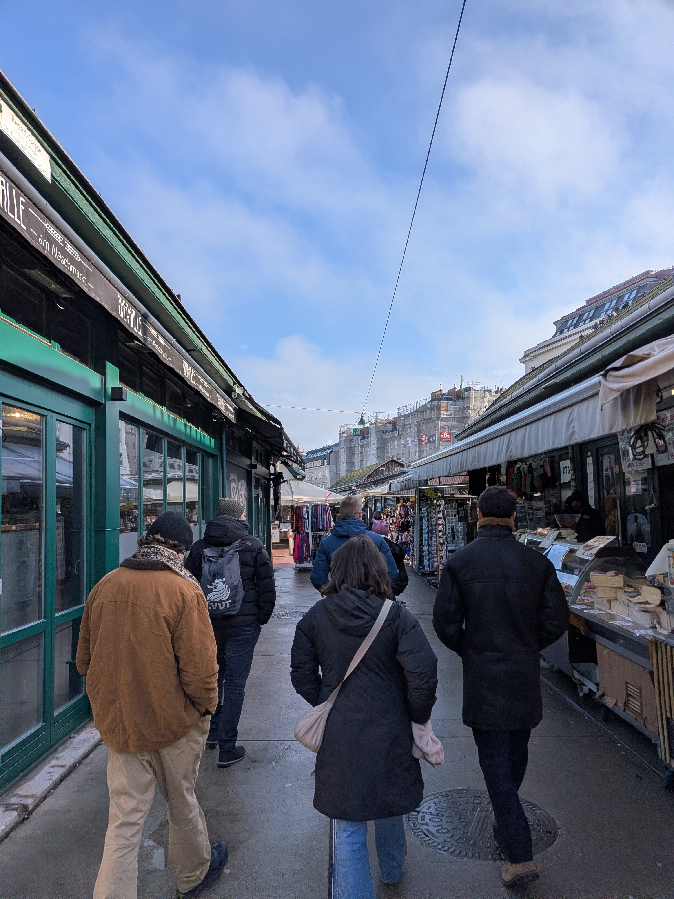

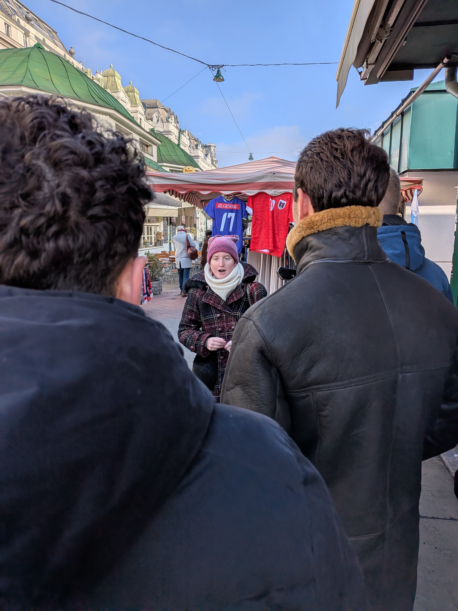

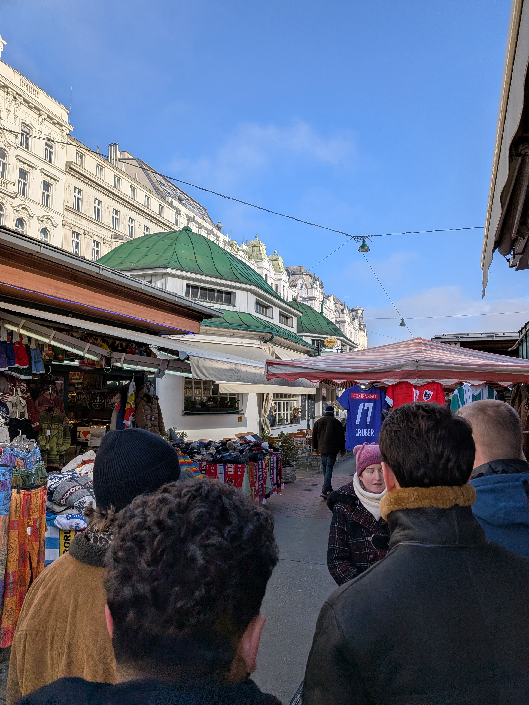

Then we headed towards the city centre and she pointed out even more interesting
sights.

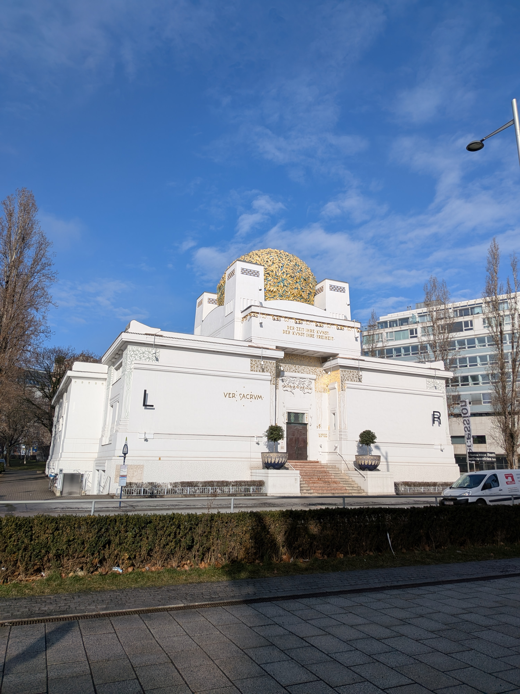

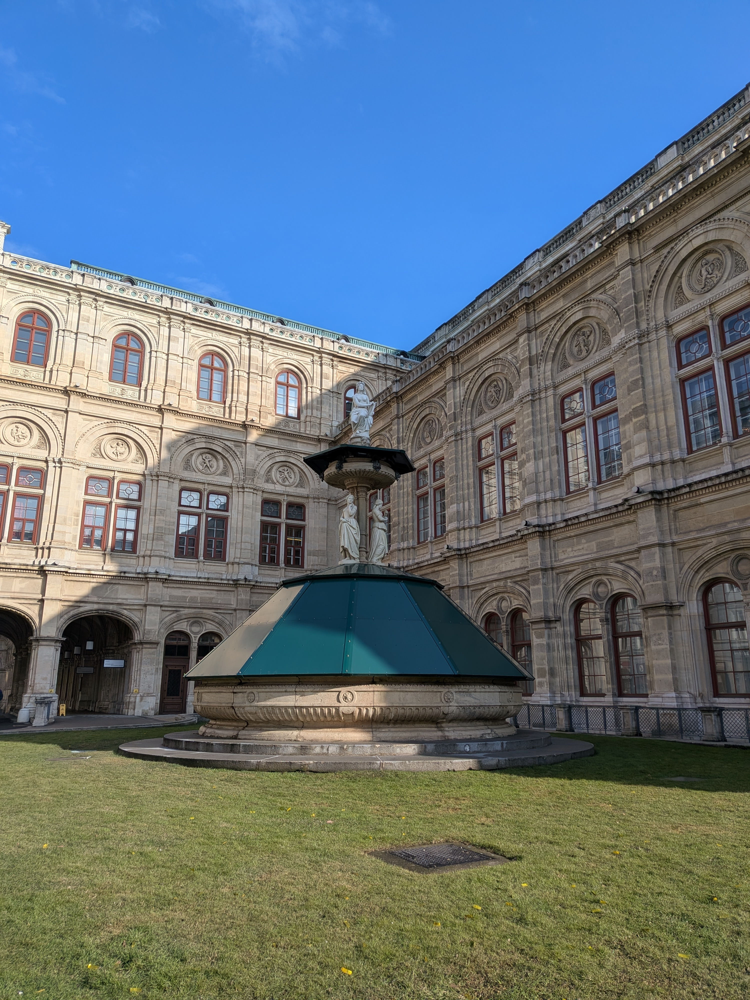

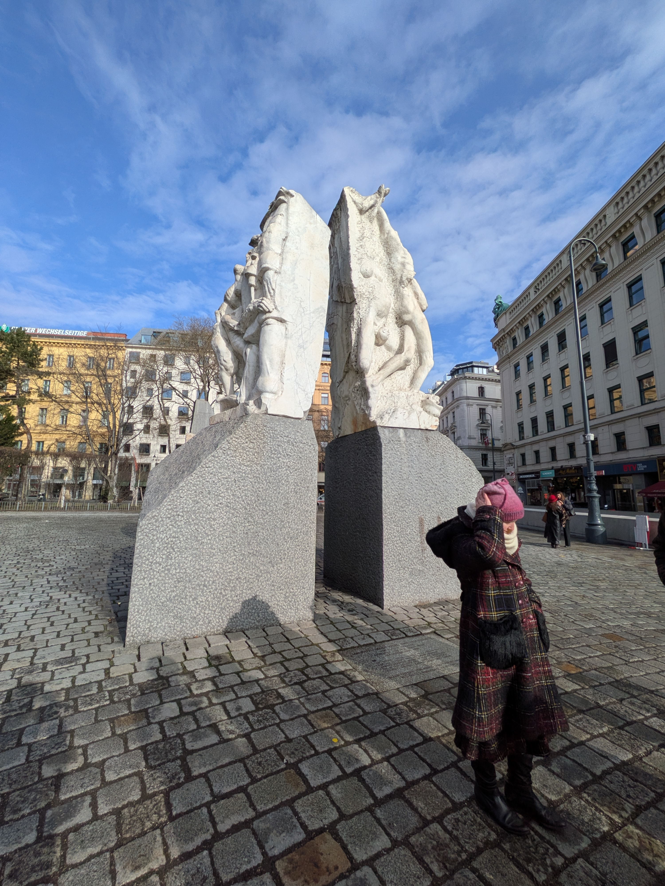

Towards the end of the tour, she showed us an area where they train horses for
shows. This institution has been training horses there for over 450 years. She
also pointed out two places which claimed to have the original recipe for some
special Viennese cake. The claim of who could claim the original cake had to be
decided by the supreme court of Austria. In another area, they have left an
excavated area where the foundations of buildings dating back to the Roman era
were visible.

After the tour, a group of six of us continue together to walk to St. Stephen's
Cathedral. It as a very spectacular Gothic style cathedral.

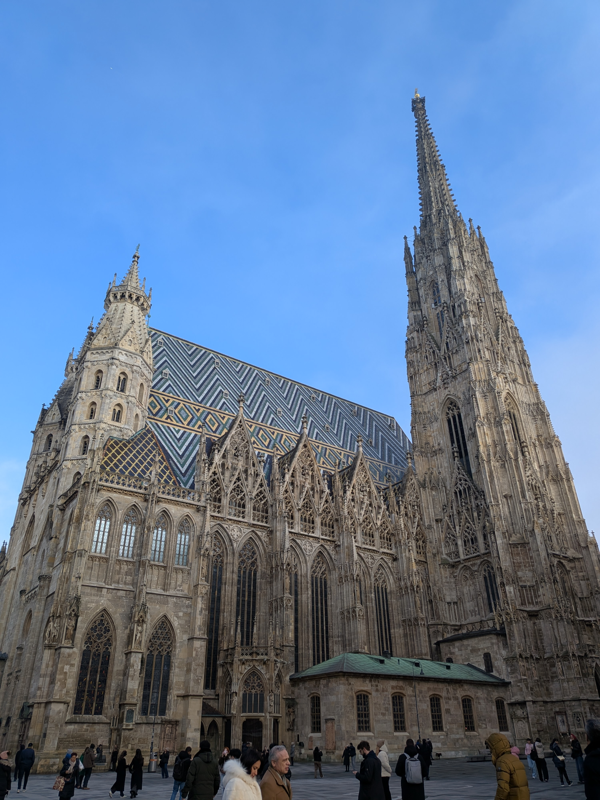

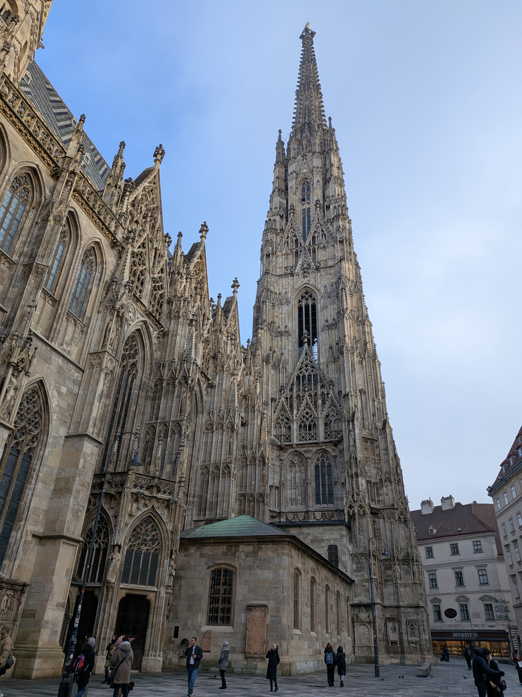

Then, we all walked to a pub for lunch. I had a delicious (and altogether too
big) dish of chicken, mushrooms, and spätzle covered with melted cheese.

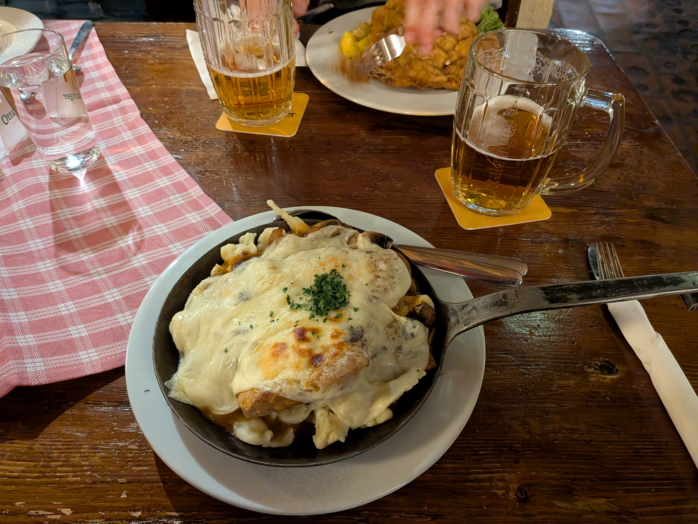

The restaurant had a very cool atmosphere.

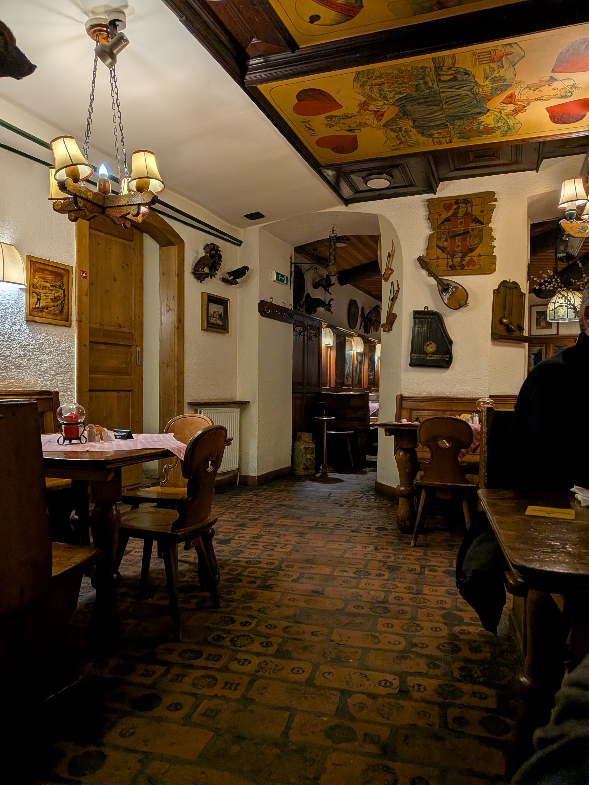

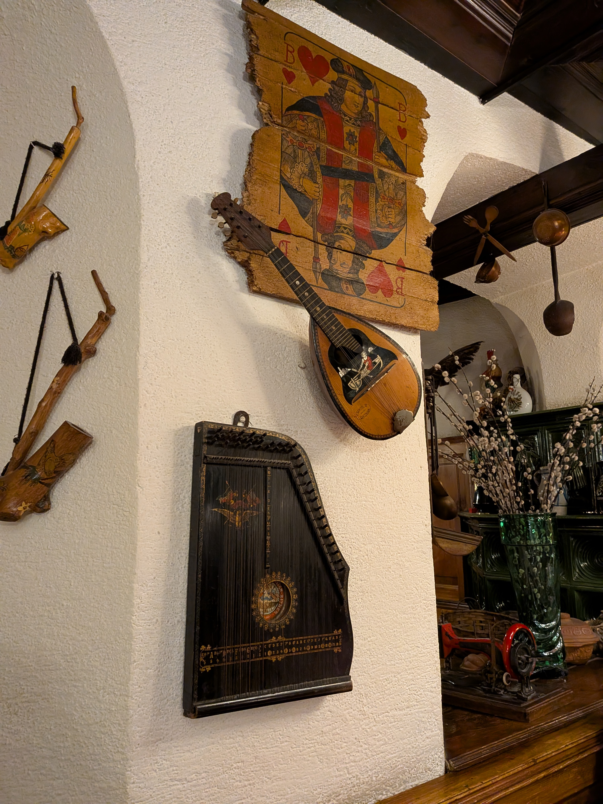

After that, we went off in different directions. I walked through the city
towards the Danube. It became more of a modern city that direction, so after I
crossed the spur that Vienna is situated on, I headed back to the hostel.

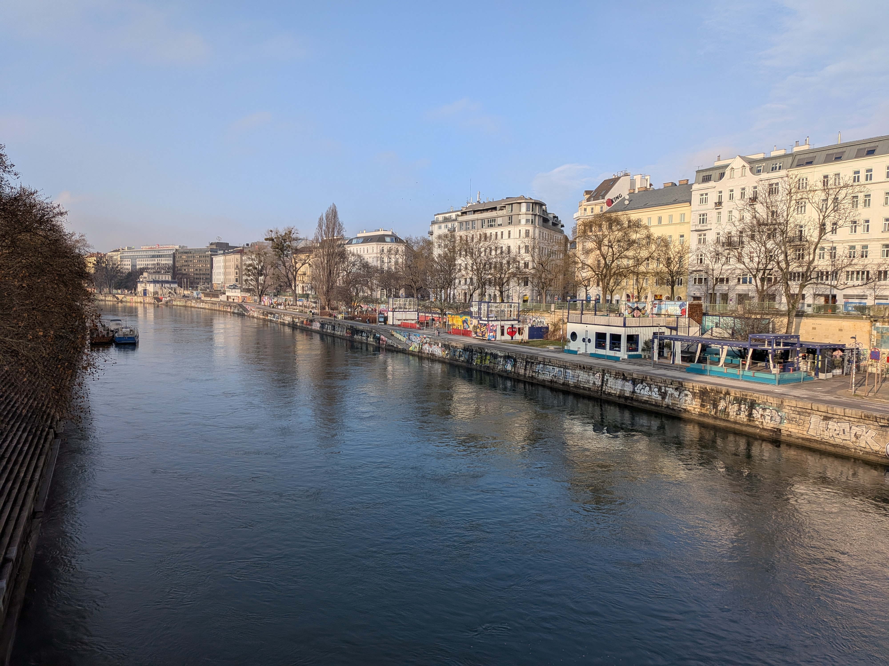

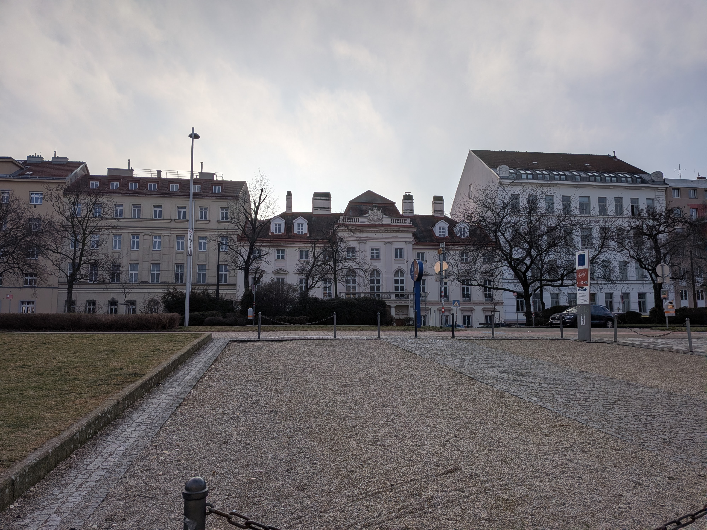

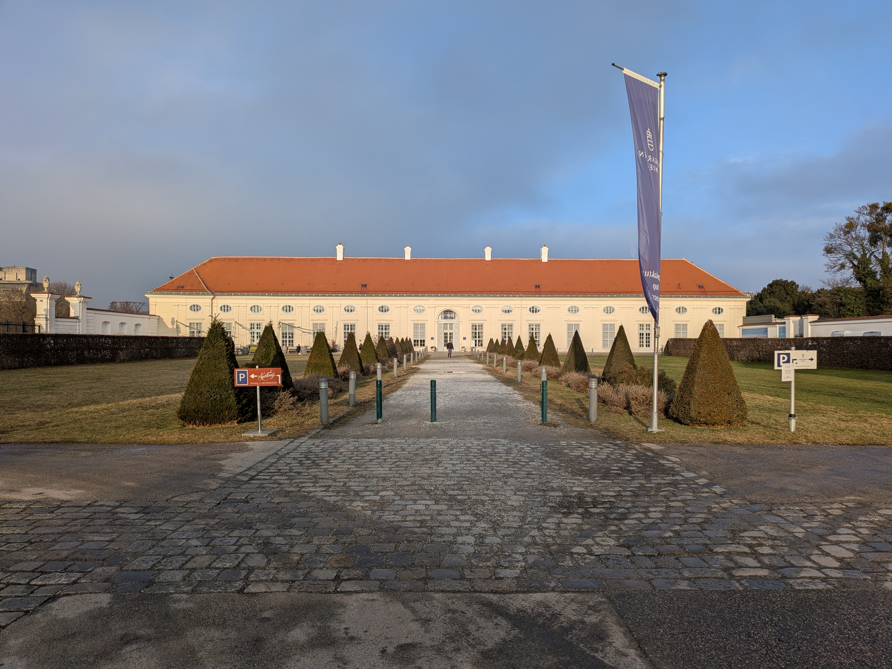

It was mid-afternoon by then, and so I decided to go back to the hostel and took
a nap. I intended for it to be an hour nap, but three hours later I woke up. I
went to the hostel bar and met some of the people from the walking tour. We had
a few drinks and chatted, and I worked a bit on my blog posts.

A few people are going to meet up to take the train tomorrow morning to
Bratislava, and since I was already thinking that might be a fun day-trip, I
decided to join their plans.
